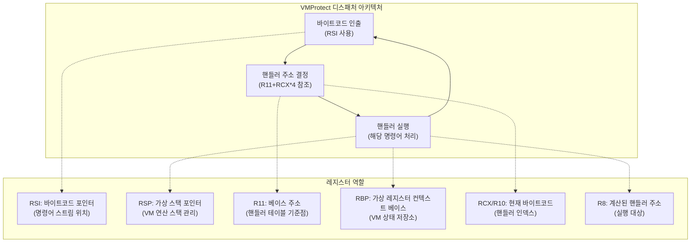
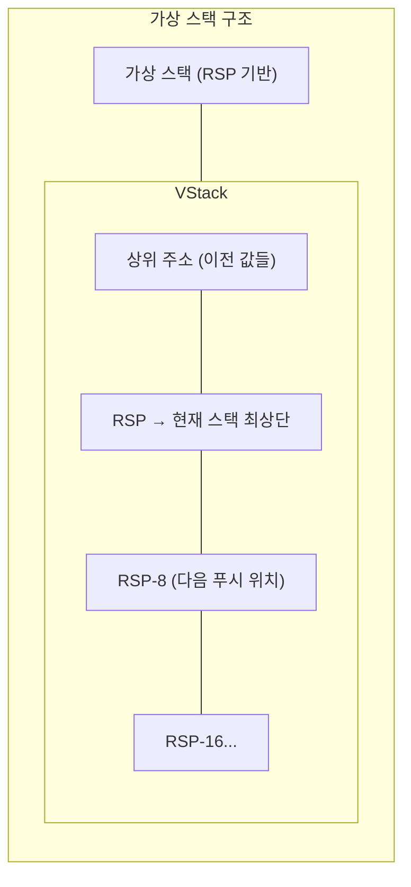
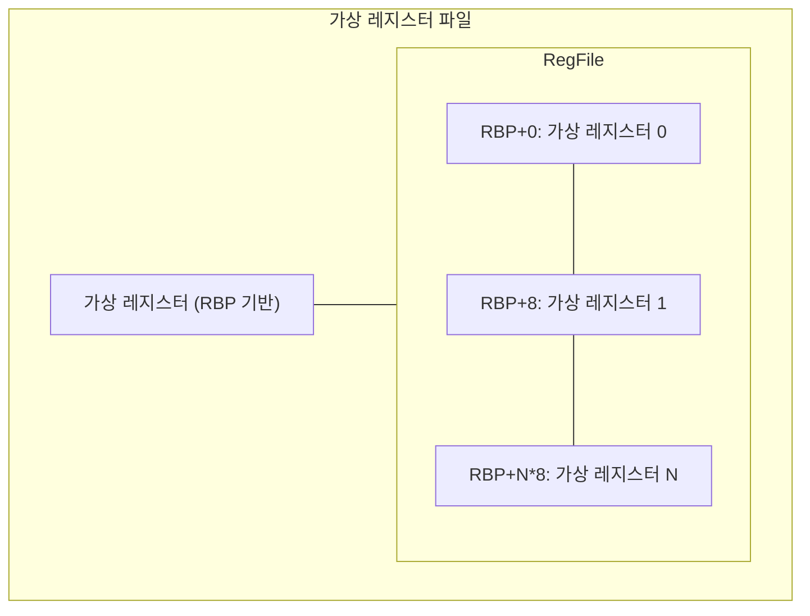
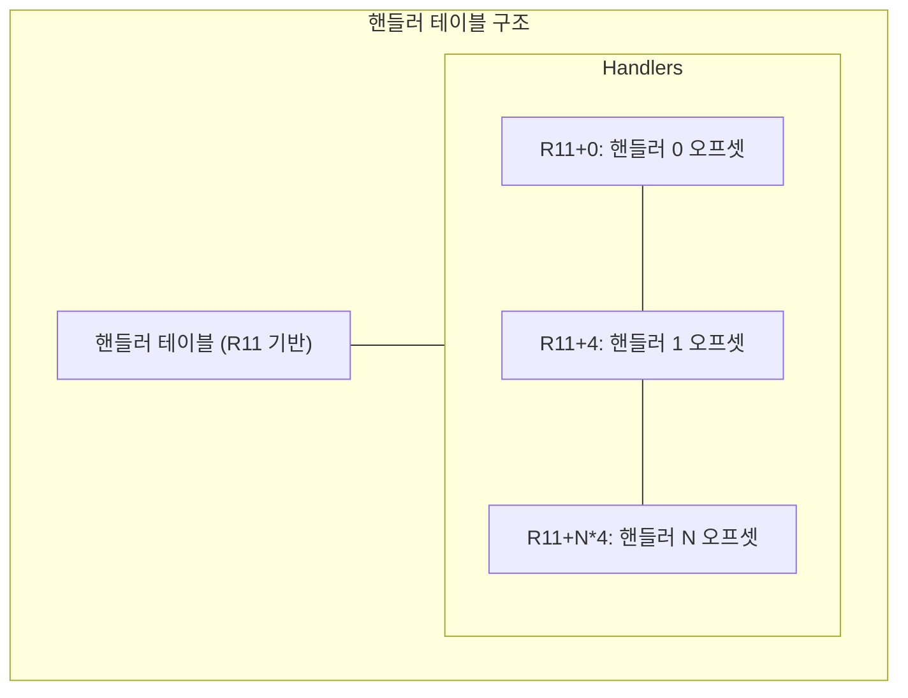

### 조해성(GDOCCHI)

---

## 목차

---

1. Anti Reverse Engineering
2. Code Virtualization
- 예제 제작
- 가상화 준비 단계
- Dispatcher-Handler 루프
- 코드 가상화 분석을 통해 얻을 수 있는 것
3. Anti Debugging
- 디버거 감지 테스트
- 분석 대상 기법
- 배경지식
- Anti Debugging 우회
4. 마치며
5. 참고자료 

## Anti Reverse Engineering

---

안녕하세요! HSPACE의 현장 실습생으로 근무 중인 조해성(GDOCCHI)입니다.

상용 프로그램(예: 게임, 보안 프로그램 등)은 외부에서 코드를 들여다보거나 조작받지 않도록 다양한 기술로 스스로를 보호합니다. 그 중에서도 분석을 어렵게 만드는 대표적인 기법이 코드 가상화(Code Virtualization) 와 안티 디버깅(Anti Debugging) 입니다. 이 글에서는 이 두 가지 기법이 어떻게 동작하고, 우리가 분석할 때 어떤 식으로 이를 우회할 수 있는지 실제 예제를 통해 살펴보겠습니다.


## Code Virtualization

---

### 예제 제작

간단한 예제를 작성하고 VMProtect로 가상화를 적용한 뒤, 함수 호출 방식이 어떻게 바뀌는지를 중심으로 동작 흐름을 분석해봅니다.

#### 예제 코드

```c
#include <stdio.h>
void helloWorld() {
    printf("Hello World!");
}

void main(int argc, char *argv[])
{
    printf("Main Function");
    helloWorld();
}
```

이 코드를 Visual Studio 2022를 이용해 빌드합니다.  
빌드 순서:

- 빌드 → ‘솔루션 정리’
- 프로젝트 → ‘프로젝트명’ 속성 → 구성에서 Release 선택 → 저장
- 빌드 → ‘솔루션 다시 빌드’
- ‘일괄 빌드’에서 Release 구성 체크

빌드가 완료되면, Release 또는 x64/Release 디렉토리에 .exe 파일이 생성됩니다.

VMProtect에서는 `Add Function` 버튼으로 `helloWorld` 함수를 지정합니다.


설정 과정에서는 디버깅이 가능한 상태를 유지하기 위해 대부분의 보호 옵션은 비활성화했습니다.


실행 시 터미널이 바로 꺼지는 문제가 있는데, 이는 따로 `getchar()` 등의 함수를 넣어 방지할 수 있으나, 원래 환경을 최대한 유지하기 위해 생략했습니다.


### 가상화 준비 단계


가상화되기 전의 실행 파일을 IDA 같은 리버싱 도구로 열어보면, 함수 이름(예: main, helloWorld)이 그대로 보입니다. 이런 이름 정보를 심볼(symbol) 이라고 부르며, 컴파일 시 디버깅 정보를 포함했다면 그대로 남아있습니다.
또한 printf 같은 외부 함수는 Import Address Table(IAT) 이라는 구조를 통해 연결됩니다. 이는 실행 파일이 외부 DLL에 정의된 함수를 사용할 수 있도록 돕는 테이블입니다.

하지만 VMProtect로 보호된 실행 파일은 함수 이름이 모두 사라지고, 코드 내부에서도 helloWorld() 같은 함수 호출이 직접적인 방식이 아닌 간접 호출로 바뀌게 됩니다.
예를 들어, 함수 주소를 미리 계산해놓고 나중에 실행 중에만 호출하도록 처리하거나, 가상 머신 위에서 명령어처럼 해석되도록 바뀝니다. 이로 인해 정적 분석이 훨씬 더 어려워집니다.

예를 들어 `__imp_printf`는 External Symbol로 존재하며, 이는 IAT 기반으로 외부 함수 주소를 참조하는 구조입니다. 그러나 VMProtect가 적용되면 함수 포인터만 남습니다.


이제 본격적으로 가상화가 적용된 함수를 따라가 보겠습니다.

main() 함수에서 helloWorld() 함수로 진입하는 시점을 따라가 보면, 갑자기 많은 레지스터 값을 스택에 저장(push)하는 루틴이 나옵니다. 
이 루틴은 가상화가 시작되기 직전의 초기화 단계이며, VMProtect가 자체 가상 머신을 실행하기 위해 CPU 상태를 임시로 백업하는 초기화 과정입니다. VMProtect는 이 시점에 현재 컨텍스트를 스택에 저장해 가상 머신 실행 준비를 마칩니다. 이후 가상화가 종료되면 이 값을 복원하여 원래의 실행 흐름으로 복귀합니다.


하지만 레지스터의 상태를 백업 (push) 해주는 것과 별개로 복잡한 명령어들이 다수 분포하고 있습니다. 이는 VMProtect가 가지는 Static Obfuscations 중 하나입니다.

#### Static Obfuscations
VMProtect는 기본적으로 Static Obfuscations (정적 난독화)를 가집니다. 보호 옵션들을 끄더라도 내부 코드를 보호하기 위해 다음과 같은 것들을 사용합니다.

1. 더미 코드(Dummy Code) : 실행 흐름에 영향을 미치지 않지만 공격자가 분석하기 힘들도록 여러 코드들을 삽입합니다.
2. 코드 블록 분리와 중복 삽입 : 코드 블록을 의도적으로 분리하거나 중복하여 그래프 뷰로 파악하기 힘들게 합니다.
3. 불투명 브랜칭 (Opaque Branching) : 항상 동일한 결과를 도출하는 분기문을 삽입하여 코드 흐름을 복잡하게 합니다.
4. 점프 난독화 (Jump Obfuscation) : 기존 흐름의 점프가 push + ret와 같이 변형되어 그래프 뷰를 깨뜨립니다.

위와 같은 난독화 기법으로 인해 IDA의 그래프 뷰는 구조 파악이 힘들 정도로 복잡하게 나타납니다.


이렇게 위의 명령어들 중에는 다수의 더미 코드가 포함되어 있어 이를 구분해야 하는데, 이를 위한 실용적인 판단은 다음과 같습니다.
> 실질적인 명령어 (eg : push) 실행 직전에 mov 등의 초기화 명령어가 등장한다면, 그 이전에 해당 레지스터에 수행된 연산은 모두 더미 코드일 가능성이 높습니다.


예를 들어 push rbx처럼 실제로 스택에 값을 저장하는 명령이 있다면, 그 직전에 나오는 mov rbx, ...는 진짜 명령일 가능성이 높습니다.
반면, 그 mov 이전에 rbx 값을 계속 바꾸는 다른 명령어들이 있었다면, 그건 어차피 마지막 mov로 덮어쓰이기 때문에 의미 없는 코드일 가능성이 큽니다.
이처럼 결과에 영향을 주지 않는 명령어는 더미 코드로 간주하고 분석에서 제외할 수 있습니다.

위와 같은 기준으로 더미코드를 삭제하면 다음과 같습니다.


#### 초기화 절차
가상화 준비 단계에서는 다음과 같은 일련의 초기화 절차를 따릅니다.


- **CPU 레지스터 상태 저장**

```nasm
push r8
push rcx
push rbx
push rdi
push r15
push r13
push r10
push r11
push rax
```

실행 컨텍스트 보존을 위해 주요 레지스터들을 스택에 백업합니다.
- **CPU 플래그 및 추가 레지스터 저장**

```nasm
pushfq
push rbp
push r9
push r14
push rsi
```

플래그 레지스터 및 추가 레지스터들도 백업되며, 이는 흐름에 따라 분리됩니다.
- **가상 명령어 포인터(VIP) 초기값 계산**

```nasm
mov rbx, 0
mov qword ptr ss:[rsp], rbx
mov esi, dword ptr ss:[rsp+80]
inc esi
neg esi
ror esi, 1
lea rsi, qword ptr ds:[rsi+rbx]
lea rsi, qword ptr ds:[rsi+rbx]
```

이 코드에서는 rsi라는 레지스터에 가상화된 명령어 스트림의 시작 주소, 즉 VIP(Virtual Instruction Pointer)를 계산해서 저장합니다. VIP는 VMProtect의 가상 머신이 현재 실행할 명령어의 위치를 추적하는 역할을 하며, 실제 CPU의 rip과 유사한 개념입니다.

> 참고: `rsp+80` 위치에 보호된 코드의 시작 주소가 저장되어 있을 가능성이 높습니다.

- **가상 스택 설정**

```nasm
mov rbp, rsp
lea r8, qword ptr ss:[rbp-200]
mov rsp, r8
```

가상 환경에서 사용할 새로운 스택 영역을 설정합니다.
- **핸들러 테이블 주소 로드**

```nasm
lea r11, qword ptr ds:[5309D0]
```

핸들러 테이블은 VMProtect의 Dispatcher가 참조하는 가상 명령어들의 실행 핸들러 목록입니다.

이 모든 초기화가 끝난 뒤, 본격적으로 Dispatcher 코드로 진입합니다. 이 루틴은 가상화된 바이트코드를 순차적으로 해석하며, 각 명령어에 해당하는 핸들러를 호출합니다.

다음으론 Dispatcher 루틴의 구조를 자세히 분석합니다.

<br />

### Dispatcher-Handler 루프


디스패처(Dispatcher, 이하 DS)는 가상 머신 보호 체계의 핵심 구성요소이며 다음과 같은 중요한 기능을 수행합니다:

- **명령어 해석**: 암호화된 바이트코드를 하나씩 읽어 어떤 VM 핸들러를 실행할지 결정합니다.
- **제어 흐름 관리**: 각 명령어 실행 이후 다음 명령어로 제어를 넘깁니다.
- **컨텍스트 유지**: 가상 레지스터와 플래그를 유지하며 VM 상태를 보존합니다.

디스패처는 마치 가상의 CPU처럼 동작하면서 다음과 같은 흐름으로 가상 명령어를 실행합니다.

1. rsi가 가리키는 위치에서 1바이트 가상 명령어(opcode) 를 가져옵니다.
2. 이 값을 인덱스로 사용해, 핸들러 테이블에서 해당 명령어를 처리할 주소를 계산합니다.
3. 계산된 주소로 jmp 명령어를 통해 점프합니다. 이 위치에는 실제 명령어 처리를 담당하는 핸들러(handler) 가 존재합니다.

이런 방식으로 디스패처는 바이트코드를 하나씩 해석하고 실행하는 루프를 구성하게 됩니다.


반복적으로 등장하는 디스패처 코드 구조는 다음과 같습니다:

```nasm
movzx ecx, byte ptr ds:[rsi]       ; 바이트코드 1바이트를 ecx로 가져옴
add    rsi, 1                      ; 다음 명령어를 가리킴
movsxd r8, dword ptr ds:[r11+rcx*4]; 핸들러 오프셋 가져옴
add    r8, r11                     ; r11 기준으로 실제 주소 계산
jmp    test.vmp.4F9513             ; 더미 분기
jmp    r8                          ; 핸들러로 이동
```

#### 1. 디스패처 아키텍처 + 레지스터 역할

아래는 Dispatcher 루프의 동작 순서와 각 레지스터의 역할을 도식화한 것입니다.


- `Fetch → Decode → Execute` 루프는 VMProtect의 가상화된 명령어 해석 루프입니다.
- 명령어 인출(RSI), 핸들러 인덱스 해석(RCX), 주소 계산 및 분기(R8) 과정을 반복하면서 가상 명령어가 실행됩니다.
- 이 루프는 실제 CPU와 매우 유사한 방식으로 설계되어 있으며, 가상 CPU처럼 동작합니다.




#### 2. 가상 스택 구조

VMProtect는 실제 스택과 별도로 **가상 스택(Virtual Stack)** 을 운영합니다.

- RSP를 기준으로 별도의 공간을 할당하고, 여기에 가상 연산을 위한 값들을 쌓고 사용합니다.
- 일반적인 CALL/RET 개념과 유사하지만, 이를 스스로 시뮬레이션하기 위한 구조입니다.
- 디버깅 시 이 영역의 접근 여부를 확인하면 가상 명령어 간 데이터 흐름을 추적할 수 있습니다.




#### 3. 가상 레지스터 파일

RBP는 가상 레지스터 파일의 베이스 주소로 사용됩니다.


- RBP를 기준으로 특정 오프셋에서 가상 레지스터 값을 읽고 씁니다.
- 실제 레지스터가 아닌, 가상의 컨텍스트를 운영하기 위한 메모리 기반 구조입니다.
- 핸들러 내부에서 어떤 값을 읽고 쓰는지를 추적하면 이 가상 레지스터와 연관된 로직을 파악할 수 있습니다.




#### 4. 핸들러 테이블 구조

핸들러 테이블은 가상 명령어를 실제로 수행할 **핸들러 코드의 시작 주소 목록**입니다.

- R11이 베이스 주소이며, RCX로 인덱싱하여 `R11 + RCX * 4` 위치의 값을 참조합니다.
- 이 값은 핸들러 오프셋이며, 다시 `add r8, r11`로 전체 주소를 완성하여 분기합니다.
- 분석 시 이 테이블의 시작 주소와 핸들러들을 함께 추적해야 전체 명령어 세트를 파악할 수 있습니다.



명령어 해석의 예시는 다음과 같습니다:

```nasm
movzx ecx, byte ptr ds:[rsi]
; rsi = 0x4a7a74 → rcx = 0xfa

add rsi, 1
; rsi = 0x4a7a75

movsxd r8, dword ptr [r11 + rcx*4]
; r11 = 0x4F49B8 → r8 = 0x1160

add r8, r11
; r8 = 0x4F5B18

jmp r8
; 0x4F5B18 핸들러 실행
```

### 코드 가상화 분석을 통해 얻을 수 있는 것
VMProtect의 코드 가상화는 단순한 난독화를 넘어선 복잡한 보호 메커니즘입니다. 내부적으로는 가상 CPU를 직접 구현한 구조를 따르기 때문에, 이를 분석하는 과정은 **실제 CPU의 동작을 시뮬레이션하는 것과 유사한 수준의 추상화와 이해력**을 요구합니다.
특히, 가상화 구조를 이해하지 못하면 분석 중간에 나오는 각종 점프, 연산, 조건 분기 등이 **왜 등장했는지조차 파악하기 어려운 수준**의 흐름으로 보일 수 있습니다.

코드 가상화된 실행 흐름을 분석하거나 우회하고자 한다면 가상 머신 내부 명령어를 추적하여 각 핸들러가 어떤 동작을 하는지 파악을 하거나, 동적 분석을 통해 원하는 실행 흐름이 어디서 나타나는지 파악해야 합니다.
복잡하더라도 구조의 규칙성을 파악하고, 반복되는 패턴을 기반으로 **전체 흐름을 하나씩 정리해 나가는 것**이 가장 중요합니다.

이제 다음 섹션에서는 코드 가상화 외에 상용 보호 기술 중 하나인 **Anti Debugging 기법**과 그 우회에 대해 분석해보겠습니다.

<br />


## Anti Debugging

---

**Anti-Debugging**은 프로그램이 실행 중일 때, 디버거(x64dbg, OllyDbg 등)가 붙어서 내부 동작을 들여다보거나 조작하려고 할 때 이를 탐지하거나 실행을 중단시키는 기술입니다.
이 글에서는 대표적인 **Static Anti-Debugging 기법**을 중심으로 Themida가 사용하는 탐지 기술을 분석하고, 이를 **Frida를 이용해 동적으로 우회하는 방법**까지 실습해보겠습니다.

### 디버거 감지 테스트


**Build: 테스트용 exe 파일 생성**

Themida 테스트 프로그램을 만들기 위해 Visual Studio 2022를 사용해 `.exe` 파일을 제작했습니다. 제작 방법은 코드 가상화에서 진행한 방법과 동일합니다.

**Themida 적용 (Demo 버전)**

- Input Filename에 `.exe` 파일 지정
- Option 설정 후 **Protect** 버튼 클릭
- 결과로 약 100배 용량이 증가된 패킹 파일 생성됨


> ⚠️ 주의: Themida로 패킹된 실행 파일은 일부 백신에서 악성코드로 오탐지될 수 있습니다. 분석 전에는 실시간 감지 기능을 일시적으로 비활성화하는 것이 필요합니다.


x64dbg로 실행하면 다음과 같은 메시지가 뜨며, 프로그램이 종료됩니다.

<div align="center">
  
</div>
실질적인 우회를 위해서는 **스킬라하이드(Skidhide)** 같은 **디버거 숨김 플러그인**을 활성화하고 디버깅을 진행해야 합니다.

#### 패킹 여부 확인


실행 파일이 패킹되었는지 확인하기 위한 도구로는 `Exeinfo PE`, `Detect It Easy(DIE)` 등이 있으며,  
패커 종류와 버전을 자동으로 탐지해줍니다.


[Exeinfo PE 0.0.8.8 다운로드 링크](https://exeinfo.uptodown.com/windows)

### 분석 대상 기법


Themida는 수십 가지의 탐지 기법을 지원하지만, 이번 글에서는 다음 기법들을 직접 분석하고 우회해봅니다.

**Static 기반 탐지**

- `IsDebuggerPresent()`
- `CheckRemoteDebuggerPresent()`
- `NtQueryInformationProcess()`
- `PEB.BeingDebugged`, `NtGlobalFlag`

<br />


### 배경지식


Anti-Debugging 기법을 우회하려면, Windows 내부에서 디버깅 여부를 어떻게 판단하고 처리하는지를 이해해야 합니다. 이때 중심이 되는 구조체가 TEB (스레드 정보) 와 PEB (프로세스 정보) 입니다.


#### 1. TEB (Thread Environment Block)

- 각 **스레드마다 존재하는 구조체**로, 해당 스레드에 대한 정보 및 프로세스의 PEB를 참조합니다.
- 어셈블리에서 흔히 보이는 `fs:[0x30]` (x86) 또는 `gs:[0x60]` (x64)는 TEB의 주소이며, 이 위치에 PEB 포인터가 존재합니다.

```c
typedef struct _TEB {
  PVOID Reserved1[12];           // 32bit 기준 offset 0x30
  PPEB  ProcessEnvironmentBlock; // PEB 포인터
  ...
} TEB, *PTEB;
```


#### 2. PEB (Process Environment Block)

- PEB는 **프로세스 단위로 존재**하며, 모듈 목록, 환경 변수, 디버깅 여부 등을 포함하는 중요한 구조체입니다.
- `IsDebuggerPresent()` 함수가 참조하는 `BeingDebugged` 플래그는 이 구조체 내 offset 0x02 위치에 있습니다.

```c
typedef struct _PEB {
  BYTE  Reserved1[2];
  BYTE  BeingDebugged;    // @ offset +0x02
  ...
  ULONG NtGlobalFlag;     // @ offset +0x68 (x86 기준)
  ...
} PEB, *PPEB;
```

- `NtGlobalFlag` 역시 디버깅 여부 탐지 시 많이 활용됩니다.


#### 3. BeingDebugged는 누가 설정하는가?

이제 해당 플래그가 **어디서, 어떤 조건으로 설정되는지**를 알아봅시다.

- 프로세스 생성 과정은 다음과 같이 커널로 넘어갑니다.

```
User Mode:
  CreateProcessA()
    ↓
  kernel32.dll → ntdll.dll → NtCreateUserProcess (syscall)
    ↓
Kernel Mode:
  ntoskrnl.exe → EPROCESS 생성
```

- 커널에서 생성된 `EPROCESS` 구조체는 내부적으로 `DebugPort` 값을 가집니다.
  - **디버거가 붙어 있는 경우**: `EPROCESS.DebugPort ≠ NULL`
  - 이 조건이 참이면, 커널은 유저모드에 노출되는 `PEB->BeingDebugged` 값을 `1`로 설정합니다.


#### 4. 디버거가 붙는 흐름 요약

**예시: 디버깅 모드로 프로세스 실행**

```c
CreateProcess(
  "C:\target.exe",
  NULL, NULL, NULL, FALSE,
  DEBUG_PROCESS,  // 디버깅 모드
  NULL, NULL, &si, &pi
);
```

- 해당 플래그 설정에 따라 커널은 `PEB->BeingDebugged = 1`을 반환하도록 설정합니다.

**예시: 이미 실행 중인 프로세스에 Attach**

<div align="center">
  <table>
    <thead>
      <tr>
        <th>방식</th>
        <th>설명</th>
        <th>API 함수</th>
      </tr>
    </thead>
    <tbody>
      <tr>
        <td>Attach</td>
        <td>실행 중인 프로세스에 연결</td>
        <td><code>DebugActiveProcess(pid)</code></td>
      </tr>
    </tbody>
  </table>
</div>


#### 5. x86 vs x64 차이

<div align="center">
  <table>
    <thead>
      <tr>
        <th>항목</th>
        <th>x86</th>
        <th>x64</th>
      </tr>
    </thead>
    <tbody>
      <tr>
        <td>세그먼트 레지스터</td>
        <td>fs</td>
        <td>gs</td>
      </tr>
      <tr>
        <td>TEB 오프셋</td>
        <td>fs:[0x30]</td>
        <td>gs:[0x60]</td>
      </tr>
      <tr>
        <td>주소 크기</td>
        <td>4바이트</td>
        <td>8바이트</td>
      </tr>
    </tbody>
  </table>
</div>


이처럼 x86과 x64에서는 TEB의 세그먼트 레지스터와 오프셋이 다르므로, PEB 위치를 참조하는 방식도 달라집니다. 따라서 우회 스크립트를 작성할 때는 **반드시 아키텍처를 구분하여 분기 처리**해야합니다. 만약 디버깅 탐지 우회 스크립트를 작성할 때 이 차이를 고려하지 않으면 잘못된 위치의 데이터를 조작하거나, 실행 오류가 발생할 수 있습니다.

이와 같은 구조는 모든 Static Anti-Debugging 탐지 기법의 기반이 되므로, 이 개념을 이해하고 있어야 이후의 우회 로직도 자연스럽게 연결됩니다.

<br />

### Anti Debugging 우회
#### 실습용 예제 코드

```cpp
#include <windows.h>
#include <stdio.h>
#include <tlhelp32.h>

// 직접 enum 정의 (Visual Studio에서 필요)
typedef enum _PROCESSINFOCLASS {
    ProcessBasicInformation = 0,
    ProcessDebugPort = 7
} PROCESSINFOCLASS;

// Native API 함수 포인터 typedef
typedef LONG NTSTATUS;
typedef NTSTATUS(NTAPI* NtQueryInfoProcess)(
    HANDLE, PROCESSINFOCLASS, PVOID, ULONG, PULONG
    );

void check_IsDebuggerPresent() {
    if (IsDebuggerPresent())
        printf("[!] IsDebuggerPresent: 디버거 감지됨\\n");
    else
        printf("[*] IsDebuggerPresent: 디버거 없음\\n");
}

void check_CheckRemoteDebuggerPresent() {
    BOOL debuggerPresent = FALSE;
    CheckRemoteDebuggerPresent(GetCurrentProcess(), &debuggerPresent);

    if (debuggerPresent)
        printf("[!] CheckRemoteDebuggerPresent: 디버거 감지됨\\n");
    else
        printf("[*] CheckRemoteDebuggerPresent: 디버거 없음\\n");
}

void check_NtQueryInformationProcess() {
    NtQueryInfoProcess NtQueryInformationProcess =
        (NtQueryInfoProcess)GetProcAddress(
            GetModuleHandleA("ntdll.dll"),
            "NtQueryInformationProcess"
        );

    if (!NtQueryInformationProcess) {
        printf("[-] NtQueryInformationProcess 로딩 실패\\n");
        return;
    }

    ULONG_PTR debugPort = 0;
    NTSTATUS status = NtQueryInformationProcess(
        GetCurrentProcess(),
        (PROCESSINFOCLASS)7,  // 또는 ProcessDebugPort
        &debugPort,
        sizeof(debugPort),
        NULL
    );

    if (status == 0 && debugPort != 0)
        printf("[!] NtQueryInformationProcess(ProcessDebugPort): 디버거 감지됨\\n");
    else
        printf("[*] NtQueryInformationProcess(ProcessDebugPort): 디버거 없음\\n");
}

void check_PEB() { // _M_IX86 : x86 프로세서 대상으로 하는 컴파일 = 600 정의. x64/ARM 컴파일 정의 X
#ifdef _M_IX86
    PVOID peb = (PVOID)__readfsdword(0x30); 
#else
    PVOID peb = (PVOID)__readgsqword(0x60);
#endif

    BYTE beingDebugged = *((PBYTE)((PBYTE)peb + 2));
    DWORD ntGlobalFlag = *((PDWORD)((PBYTE)peb + 0x68));

    printf("[*] PEB.BeingDebugged: %s (%d)\\n",
        beingDebugged ? "디버거 감지됨" : "없음", beingDebugged);

    printf("[*] PEB.NtGlobalFlag:  0x%x %s\\n", ntGlobalFlag,
        (ntGlobalFlag & 0x70) ? "(디버거 감지됨)" : "(정상)");
}

int main() {
    printf("==== 디버거 탐지 테스트 시작 ====\\n\\n");

    check_IsDebuggerPresent();
    check_CheckRemoteDebuggerPresent();
    check_NtQueryInformationProcess();
    check_PEB();
    // 프로그램을 두 번 실행하는 이유:
    // 1. 첫 번째는 디버거가 붙은 상태에서 탐지 함수들이 어떤 값을 출력하는지 확인
    // 2. Frida로 attach한 뒤 다시 탐지 함수를 호출하여 우회 여부 확인
    printf("\\n[!] frida attach 대기 중... attach 후 아무 키나 입력하세요.\\n");
    getchar();  // 사용자가 키 입력할 때까지 대기

    check_IsDebuggerPresent();
    check_CheckRemoteDebuggerPresent();
    check_NtQueryInformationProcess();
    check_PEB();

    printf("\\n==== 테스트 완료. 엔터를 누르면 종료 ====\\n");
    getchar();
    return 0;
}
```


#### 1. IsDebuggerPresent()

> 호출 프로세스가 사용자 모드 디버거에 의해 디버깅되고 있는지 여부를 확인합니다.

```c
BOOL IsDebuggerPresent();
```

내부 구현은 다음과 같습니다.

```nasm
mov eax, fs:[0x30]          ; TEB 주소
movzx eax, byte ptr [eax+2] ; PEB.BeingDebugged
ret
```

해당 함수는 TEB를 통해 PEB에 접근 → `BeingDebugged` 플래그로 디버거를 탐지하여 반환값을 통해 디버거 존재 여부를 알립니다. 만약 True라면 디버거가 존재함을, False라면 존재하지 않음을 나타냅니다.

**우회 스크립트**

```javascript
Interceptor.attach(Module.findExportByName("kernel32.dll", "IsDebuggerPresent"), {
    onLeave: function (retval) {
        retval.replace(ptr(0)); //반환값 변조
    }
});
```

아래 이미지는 IsDebuggerPresent() 호출 시 반환값을 Frida로 조작한 결과입니다. 원래는 디버거가 감지되어야 하지만, 후킹을 통해 항상 0(False)으로 반환되도록 했습니다.

<div align="center">
  
</div>
해당 함수는 kernel32.dll에 익스포트 되어있기 때문에 해당 dll을 참조하여 불러와줍니다. 익스포트 여부는 **Developer Command Prompt for VS** 을 통해 확인할 수 있습니다.


<br />


#### 2. CheckRemoteDebuggerPresent()

> 함수가 성공적으로 동작하였을 때 반환값은 0이 아닌 값이며, 실패하는 경우 0을 반환 및 `GetLastError()`를 호출합니다.

```c
BOOL CheckRemoteDebuggerPresent(
    HANDLE hProcess,            //검사하고 싶은 프로세스의 핸들이 들어갑니다.
    PBOOL  pbDebuggerPresent    //검사한 프로세스의 디버거 탐지여부가 들어갑니다.
);
```

내부 구현은 다음과 같습니다.

<div align="center">
  
</div>

`CheckRemoteDebuggerPresent()` 함수는 반환값 자체보다 **두 번째 인자인 포인터(`pbDebuggerPresent`)에 기록되는 디버깅 플래그**가 더 중요합니다. 반환값은 단순히 함수 호출의 성공 여부를 나타내며, **디버거의 존재 여부는 `pbDebuggerPresent`가 가리키는 위치에 TRUE 또는 FALSE로 기록됩니다.**

**우회 스크립트**

```javascript
Interceptor.replace(Module.findExportByName("kernel32.dll", "CheckRemoteDebuggerPresent"),
  new NativeCallback(function (hProcess, pFlag) { // 해당 함수의 인자입니다.
      if (pFlag && !pFlag.isNull()) { // 쓰기를 시도하기 전에 유효 주소를 가리키는지 확인합니다.
          Memory.writeU8(pFlag, 0);
      }
      return 1;
  }, 'int', ['pointer', 'pointer']));
```

따라서 우회 방식은 다음과 같습니다. 프로세스와 플래그가 유효한 값인 경우, Flag의 값을 False로 써줍니다.

<div align="center">
  
</div>

해당 우회에서 주의할 점은 `CheckRemoteDebuggerPresent()`함수에서 `Interceptor.attach()` 방식은 **정상적으로 동작하지 않을 수 있습니다.**  
그 이유는 `CheckRemoteDebuggerPresent()` 내부 구현에 자기 자신을 간접적으로 다시 호출하는 구조(재귀 호출)가 존재하기 때문입니다. 이 경우 Frida의 `attach` 후킹은 함수 진입 시 `onEnter`를 실행한 뒤 원래 함수를 계속 실행하게 되는데, 내부에서 다시 해당 함수로 진입하면 **또다시 onEnter가 호출되고 후킹이 반복되면서 무한 재귀 상태에 빠지게 됩니다.**

이러한 구조적 문제로 인해 `attach()` 방식은 루프를 유발할 수 있으며, 이 함수를 안정적으로 우회하려면 **`Interceptor.replace()`를 사용하는 것이 더 적합합니다.**

<br />


#### 3. NtQueryInformationProcess()

> 지정된 프로세스에 대한 정보를 검색합니다.

```c
__kernel_entry NTSTATUS NtQueryInformationProcess(
  [in]            HANDLE           ProcessHandle,
  [in]            PROCESSINFOCLASS ProcessInformationClass,
  [out]           PVOID            ProcessInformation,
  [in]            ULONG            ProcessInformationLength,
  [out, optional] PULONG           ReturnLength
);
```

내부 구현은 다음과 같습니다.


해당 함수는 `ProcessHandle` 을 통해 프로세스를 지정 -> `ProcessInformationClass` 에 검색할 정보 선택 -> `ProcessInformat`에 탐색한 정보를 저장해줍니다.

`ProcessInformationClass` 에서 디버깅 관련 정보는 다음과 같이 존재합니다.

<div align="center">
  <table>
    <thead>
      <tr>
        <th>정보 클래스</th>
        <th>탐지 방식</th>
        <th>우회 방법</th>
      </tr>
    </thead>
    <tbody>
      <tr>
        <td><code>7</code><br><code>ProcessDebugPort</code></td>
        <td>디버거 연결 여부 (<code>DebugPort != NULL</code>)</td>
        <td>Frida 후킹 or PEB 패치</td>
      </tr>
      <tr>
        <td><code>31</code><br><code>ProcessDebugFlags</code></td>
        <td>디버깅 중이면 0 반환됨</td>
        <td>반환값을 1로 후킹</td>
      </tr>
    </tbody>
  </table>
</div>

**우회 스크립트**

```javascript
Interceptor.attach(Module.getExportByName("ntdll.dll", "NtQueryInformationProcess"), {
    onEnter: function (args) {
        // this 객체에 데이터를 저장 시, onEnter와 onLeave 사이에 상태 공유가 가능합니다.
        this.infoClass = args[1].toInt32();
        this.outBuf = args[2]; //NtQ의 인자들입니다.
    },
    onLeave: function (retval) {
        if (this.infoClass === 7 || this.infoClass === 31) {
            Memory.writePointer(this.outBuf, ptr(0));
        }
    }
});
```

따라서 우회 방식은 다음과 같습니다. 해당 함수의 정보 클래스가 디버거 관련인지 확인하고, 해당하는 경우 탐지 여부를 False로 변경해줍니다.


<br />


#### 4. PEB 우회 (BeingDebugged / NtGlobalFlag)

앞에서 잠깐 설명했던 내용을 떠올려보면, IsDebuggerPresent()와 같은 API들은 결국 내부적으로 PEB(Process Environment Block) 구조체를 참조해 디버깅 여부를 판단한다고 말씀드렸습니다. 이 PEB에 접근하려면 먼저 현재 스레드의 **TEB(Thread Environment Block)**를 찾아야 하고, 그 내부에 PEB 포인터가 존재하죠.

32비트 환경에서는 fs:[0x30], 64비트 환경에서는 gs:[0x60] 오프셋을 통해 TEB의 주소를 가져올 수 있습니다. 이 오프셋이 바로 스레드 환경에서 PEB를 가리키는 필드에 해당합니다.

PEB를 얻었다면, 그 안에서 디버깅 여부를 판단하는 핵심 플래그 두 가지를 확인할 수 있습니다:

PEB + 0x02 위치에는 BeingDebugged라는 플래그가 있어, 이 값이 1이면 디버깅 중이라는 뜻이고,

PEB + 0x68 (또는 64비트에서는 0xBC)에는 NtGlobalFlag라는 값이 저장되어, 디버깅 시 특정 비트가 활성화됩니다.

**우회 스크립트**
  
  ```javascript
  (function () {
      const is64 = Process.pointerSize === 8;
      const tebOffset = is64 ? 0x60 : 0x30;
      const ntGlobalFlagOffset = is64 ? 0xBC : 0x68;
      /*
      NtCurrentTeb()는 현재 실행 중인 스레드의 TEB(Thread Environment Block) 
      주소를 반환하는 Windows Native API 함수입니다.
      */
      const NtCurrentTeb = new NativeFunction(
          Module.findExportByName('ntdll.dll', 'NtCurrentTeb'),
          'pointer',
          []
      );
  
      const teb = NtCurrentTeb();
      const peb = Memory.readPointer(teb.add(tebOffset));// TEB + offset → PEB
  
      Memory.writeU8(peb.add(0x2), 0);  // BeingDebugged 우회
      Memory.writeU32(peb.add(ntGlobalFlagOffset), 0);  // NtGlobalFlag 우회
  })();
  ```

따라서 우회 방식은 다음과 같습니다. TEB에서 PEB를 가져온 후, PEB에 존재하는 두 Flag 값을 수정해줍니다. 
이런 방식은 API 호출을 우회하는 것보다 보다 근본적인 조작이라 할 수 있습니다.


### Total Static Bypass 스크립트

모든 탐지 우회 스크립트를 통합한 버전입니다:

```javascript
//PEB 조작 시, IsDebuggerPresent()도 우회가 가능하기 때문에 별도의 우회스크립트를 넣지 않았습니다.
(function () {
    const is64 = Process.pointerSize === 8;
    const tebOffset = is64 ? 0x60 : 0x30;
    const ntGlobalFlagOffset = is64 ? 0xBC : 0x68;

    const NtCurrentTeb = new NativeFunction(
        Module.findExportByName('ntdll.dll', 'NtCurrentTeb'),
        'pointer',
        []
    );

    const teb = NtCurrentTeb();
    const peb = Memory.readPointer(teb.add(tebOffset));

    Memory.writeU8(peb.add(0x2), 0);  // PEB.BeingDebugged
    Memory.writeU32(peb.add(ntGlobalFlagOffset), 0);  // NtGlobalFlag
})(); 

Interceptor.attach(Module.getExportByName("ntdll.dll", "NtQueryInformationProcess"), {
    onEnter: function (args) {
        this.infoClass = args[1].toInt32();
        this.outBuf = args[2];
    },
    onLeave: function (retval) {
        if (this.infoClass === 7 || this.infoClass === 31) {
            Memory.writePointer(this.outBuf, ptr(0));
        }
    }
});

Interceptor.replace(Module.findExportByName("kernel32.dll", "CheckRemoteDebuggerPresent"),
    new NativeCallback(function (hProcess, pFlag) {
        if (pFlag && !pFlag.isNull()) {
            Memory.writeU8(pFlag, 0);
        }
        return 1;
    }, 'int', ['pointer', 'pointer']));
```


## 마치며
---

이번 포스트에서는 Anti Reverse Engineering에 대해 다뤄봤습니다.

이런 보호 기법들은 처음에는 분석을 어렵게 만들지만, 흐름과 구조를 반복적으로 따라가다 보면 익숙해지고, 그 과정에서 리버싱 실력도 크게 성장할 수 있다고 생각합니다.

긴 글 읽어주셔서 감사합니다.🙂

## 참고 자료
---

- [VMProtect](https://www.mitchellzakocs.com/blog/vmprotect3#introduction)
- [winternl.h](https://learn.microsoft.com/ko-kr/windows/win32/api/winternl/)
- [debugapi.h](https://learn.microsoft.com/ko-kr/windows/win32/api/debugapi/)
